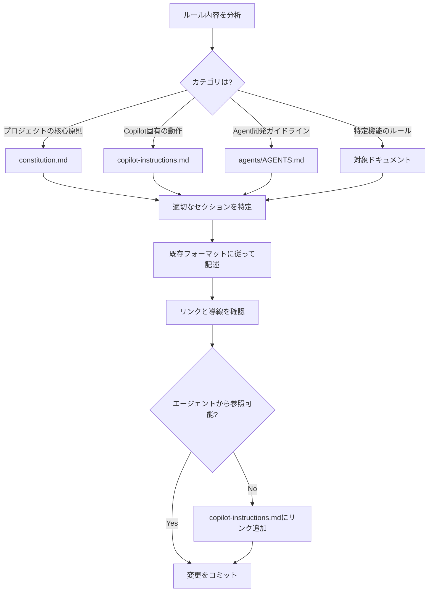

# ルール化スキル

このスキルは、ユーザーから提示されたルールや規約を適切なドキュメントに記載し、GitHub Copilot Agentが参照できる状態にします。

## 利用可能なツール

- **view**: ファイル内容の確認
- **edit**: ファイル内容の編集
- **grep**: ファイル内容の検索
- **bash**: Git操作やビルド・テストの実行

## 使用すべきタイミング

以下の場合にこのスキルを使用してください:

- ユーザーが「ルール化してください」とリクエストした場合
- 「これをルールにしたい」「今後はこうしてください」といった要望があった場合
- プロジェクトの規約や方針として定めたい内容が提示された場合

## 実行手順

### 1. ルールの内容を分析

ユーザーから提示されたルールの内容を分析し、以下のカテゴリに分類します:

- **プロジェクトの核心原則**: 開発方針、設計思想、重要な意思決定基準
- **Copilot固有の指示**: Copilot Agentの動作、コミット形式、PRの書き方
- **Agent開発ガイドライン**: Spec-Kitの使い方、ワークフロー、ドキュメント構造
- **コーディング規約**: 言語固有のスタイル、命名規則、ベストプラクティス
- **運用ルール**: デプロイ手順、レビュー基準、セキュリティ要件

### 2. 記載場所の特定

ルールのカテゴリに応じて、以下のドキュメントから適切な記載場所を特定します:

#### memory/constitution.md

**対象**: プロジェクトの核心原則、設計思想、開発方針

**記載セクション**:
- `Core Principles` - 新しい原則として追加
- `Documentation Language Policy` - 言語ポリシー関連
- `Documentation Structure Policy` - ドキュメント構造関連
- `Tools and Workflow` - ツールやワークフロー関連
- `Governance` - ガバナンス関連

**追加時の注意**:
- 既存の原則（Principle）に追加する場合は、番号を振らず既存フォーマットに従う
- 新しい原則の場合は、`Rule`と`Rationale`を含める
- バージョン番号を適切に更新（MINOR: 新原則追加、PATCH: 明確化）

#### .github/copilot-instructions.md

**対象**: GitHub Copilot Agent固有の動作指示

**記載セクション**:
- `言語ポリシー` - 日本語/英語の使い分け
- `コミットID提示のルール` - コミットメッセージやリンク形式
- `変更時の確認手順` - ビルド、テスト、検証手順
- `Spec-Kitワークフロー` - Spec-Kitの使用方法
- `セキュリティ要件` - セキュリティ関連の指示
- `コスト最適化` - AWSコスト管理

**追加時の注意**:
- Copilotが実行時に参照する内容であることを確認
- 具体的なコマンドや例を含める
- 既存のフォーマット（箇条書き、コードブロック）に従う

#### .github/agents/AGENTS.md

**対象**: Agent開発ガイドライン、Spec-Kit使用方法

**記載セクション**:
- `Spec-Kit使用の原則` - Spec-Kitのワークフロー
- `重要なルール` - Agentの動作ルール
- `ドキュメント構造` - ファイル配置
- `実装時のドキュメント更新` - ドキュメントメンテナンス
- `言語ポリシー` - エージェント用の言語ルール

**追加時の注意**:
- Agent向けの具体的な指示を記載
- ドキュメント構造や配置ルールは図を含める
- 参考資料へのリンクを含める

#### プロジェクト固有のドキュメント

**対象**: 特定の機能や領域に関するルール

- `docs/architecture/*.md` - アーキテクチャ関連
- `docs/business/*.md` - ビジネスルール関連
- `infrastructure/README.md` - インフラ関連
- `.github/workflows/README.md` - CI/CD関連

### 3. エージェントのアクセス性確認

ルールを記載した後、以下を確認します:

#### リンクの確認

```bash
# 記載場所から既存ドキュメントへのリンクを検索（bashツールを使用）
grep -n '\[.*\](.*\.md)'
```

以下のリンクが適切に設定されているか確認:
- `copilot-instructions.md` → `agents/AGENTS.md`
- `copilot-instructions.md` → `memory/constitution.md`
- `agents/AGENTS.md` → `copilot-instructions.md`
- `agents/AGENTS.md` → `memory/constitution.md`

#### 参照可能性の確認

GitHub Copilot Agentが参照できる状態を確認:

1. **copilot-instructions.md からの導線**
   - 重要なドキュメントへのリンクがあるか
   - 「このドキュメントに記載された指示に加えて...」のセクションに含まれているか

2. **メモリへの記録（必要に応じて）**
   - `store_memory` ツールで重要なルールを記録
   - カテゴリ: `general`, `file_specific`, `user_preferences`
   - 短い事実として記録（200字以内）

### 4. 記載内容の作成

ルールを既存のドキュメントフォーマットに従って記述します:

#### フォーマットのガイドライン

1. **箇条書きを活用**
   - 可読性を高めるため、長文は避ける
   - 重要なポイントを箇条書きで列挙

2. **具体例を含める**
   - コマンド例、コード例を含める
   - 「良い例」「悪い例」を示す

3. **理由を明記**
   - なぜそのルールが必要かを説明
   - `Rationale` や「理由」セクションを含める

4. **Mermaid図の使用**
   - フローやプロセスを図で示す場合はMermaidを使用
   - 複雑な構造は図で視覚化

### 5. 変更の検証

ルールを記載した後、以下を確認します:

```bash
# リンク切れチェック（bashツールを使用）
grep '\[.*\](.*\.md)'

# Markdownフォーマットチェック（ヘッダー、リスト構造）
view path/to/updated/file.md

# 言語ポリシー準拠確認（日本語で記述されているか）
# 技術用語は英語で保持されているか
```

## 記載場所の判断フローチャート



## 例

### 例1: コミットメッセージのルール化

**ユーザー要望**: 「コミットメッセージは必ず日本語で書いてください」とルール化してください

**分析**:
- カテゴリ: Copilot固有の動作
- 記載場所: `.github/copilot-instructions.md`

**手順**:
1. `copilot-instructions.md` の「言語ポリシー」セクションを確認
2. 既に記載があるか確認
3. なければ、日本語使用箇所に「コミットメッセージ」を追加
4. 理由を記載（一貫性、チーム理解の容易さ）

### 例2: テスト実装の原則化

**ユーザー要望**: 「すべての機能は必ずテストを書いてください」をルール化してください

**分析**:
- カテゴリ: プロジェクトの核心原則
- 記載場所: `memory/constitution.md`

**手順**:
1. `constitution.md` の「Core Principles」セクションを確認
2. 既に「Principle 4: テスト可能性」が存在することを確認
3. 既存の原則で十分カバーされているため、新規追加は不要
4. ユーザーに既存の原則を案内

### 例3: AWS命名規則のルール化

**ユーザー要望**: 「AWS リソースには必ず `attendance-kit-` のプレフィックスを付けてください」をルール化してください

**分析**:
- カテゴリ: インフラ関連の規約
- 記載場所: `infrastructure/README.md` または `docs/architecture/aws-resources.md`

**手順**:
1. インフラ関連ドキュメントを確認
2. 適切なセクション（例: 命名規則）を探す
3. なければ新規セクションを作成
4. 命名規則とその理由を記載
5. `copilot-instructions.md` の「セキュリティ要件」または「コスト最適化」セクションに参照を追加
6. または `docs/architecture/` に専用ドキュメントを作成（例: `aws-naming-conventions.md`）

## ベストプラクティス

### ルールの記載時

1. **重複を避ける**
   - 既存のルールを確認し、重複する内容は統合
   - 複数箇所に同じ内容を書かない

2. **具体性を持たせる**
   - 抽象的なルールではなく、実行可能な指示を記載
   - コマンド例やコードサンプルを含める

3. **理由を明記する**
   - なぜそのルールが必要かを説明
   - チームの理解と納得を促進

4. **メンテナンス性を考慮**
   - 変更が必要になった時に見つけやすい場所に記載
   - ドキュメント間のリンクを適切に設定

### エージェントのアクセス性向上

1. **copilot-instructions.mdを起点にする**
   - 重要なルールは必ずcopilot-instructions.mdから辿れるようにする
   - リンクまたは直接記載で参照可能にする

2. **store_memoryの活用**
   - 頻繁に参照されるルールはメモリに記録
   - エージェントのコンテキストに含まれやすくする

3. **階層的な構造**
   - 概要はcopilot-instructions.md
   - 詳細は個別のドキュメント
   - リンクで接続

## 注意事項

- **バージョン管理**: constitution.mdを更新する場合は、バージョン番号と日付を更新
- **影響範囲の確認**: ルールの追加が既存の動作に影響しないか確認
- **チームへの周知**: 重要なルール追加はPRで説明し、レビューを受ける
- **定期的な見直し**: ルールが陳腐化していないか定期的に確認

## 参考資料

- **プロジェクト憲法**: `memory/constitution.md`
- **Copilotカスタムインストラクション**: `.github/copilot-instructions.md`
- **Agent開発ガイドライン**: `.github/agents/AGENTS.md`
- **GitHub Agent Skills**: [公式ドキュメント](https://docs.github.com/ja/copilot/concepts/agents/about-agent-skills)
