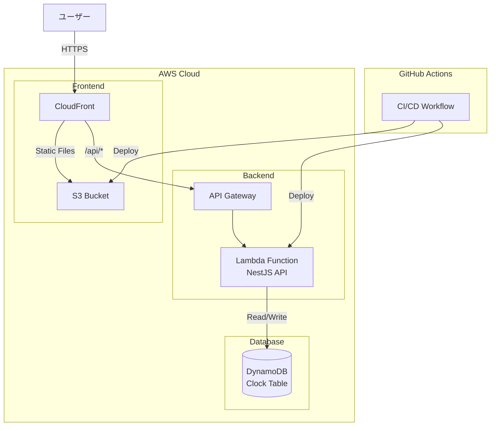

# 勤怠管理キット

[](https://github.com/goataka/attendance-kit/actions/workflows/deploy-environment-stack.yml)
[](https://github.com/goataka/attendance-kit/actions/workflows/deploy-account-stack.yml)
[](https://github.com/goataka/attendance-kit/actions/workflows/premerge.yml)

このプロジェクトはエージェントのみで構築する勤怠管理システムです。

## 🌏 言語ポリシー

- **仕様書・要件定義**: 日本語
- **コード・技術文書**: 英語
- **コミュニケーション**: 日本語

詳細は [Copilotインストラクション](.github/copilot-instructions.md) を参照してください。

## 🏗️ プロジェクト構造

```text
.
├── .devcontainer/     # DevContainer設定
│   └── devcontainer.json
├── .github/
│   ├── skills/        # GitHub Copilot Agent Skills定義
│   └── workflows/
│       └── premerge.yml             # PR時のCI/CD
├── apps/              # アプリケーション（npmワークスペース）
│   ├── frontend/      # フロントエンドアプリケーション
│   ├── backend/       # バックエンドアプリケーション
│   └── website/       # Webサイト
├── scripts/           # 開発・CI/CD支援スクリプト
├── docs/              # ドキュメント
├── infrastructure/    # インフラストラクチャコード
├── package.json       # モノレポルート設定
└── README.md          # このファイル
```

## 📦 モノレポ構成

このプロジェクトは **npm workspaces** と **TurboRepo** を使用したモノレポ構成です。

TurboRepoにより、タスクの並列実行と増分ビルドのキャッシングが可能になり、ビルド時間が大幅に短縮されます。

### アプリケーション

- **@attendance-kit/frontend**: フロントエンドアプリケーション
- **@attendance-kit/backend**: バックエンドアプリケーション
- **@attendance-kit/website**: Webサイト

### 共通コマンド

```bash
# 依存関係のインストール
npm install

# 全アプリケーションの開発サーバー起動
npm run dev

# 全アプリケーションのビルド
npm run build

# 全アプリケーションのテスト実行
npm test

# 全アプリケーションのLintチェック
npm run lint

# プレマージワークフローのローカル実行
npm run premerge:local
```

**プレマージワークフロー実行の必要条件**:

- Docker が起動していること
- [act](https://github.com/nektos/act) がインストールされていること（`brew install act` または [公式サイト](https://github.com/nektos/act)参照）

### 個別アプリケーションでのコマンド実行

```bash
# 特定のワークスペースでコマンド実行
npm run dev -w @attendance-kit/frontend
npm run build -w @attendance-kit/backend
npm test -w @attendance-kit/website
```

## 🤖 GitHub Copilot Agent Skills

このプロジェクトは、GitHub Copilot Agentが使用できるスキルを定義しています。詳細は [.github/skills/README.md](.github/skills/README.md) を参照してください。

## 🚀 開発環境セットアップ

DevContainerを使用した一貫性のある開発環境を提供します。

### DevContainerの使用

VS Codeでコマンドパレットから "Dev Containers: Reopen in Container" を実行してください。

詳細は [.devcontainer/README.md](.devcontainer/README.md) を参照してください。

### コミット前の自動チェック

このプロジェクトでは、コミット前にlint-stagedとhuskyを使用して、ステージングエリアのファイルのみに対してコード品質チェックを実行します：

- **Backend TypeScript**: ESLint（Prettier連携）
- **Frontend TypeScript**: ESLint
- **Shell Scripts**: shellcheck
- **GitHub Actions YAML**: actionlint
- **Markdown**: Prettier
- **YAML**: Prettier

コミット時に自動実行されるため、手動での実行は不要です。全体のlintチェックは `npm run lint` で実行できます。

## 🏗️ システム構成図



## 📝 ドキュメント

- [Copilotインストラクション](.github/copilot-instructions.md)
- [アーキテクチャドキュメント](docs/architecture/README.md)
- [ビジネス仕様](docs/business/README.md)
