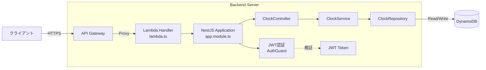

# Attendance Kit Backend

NestJS製のバックエンドAPI - AWS Lambda + API Gatewayにデプロイ

## 構成図



## 技術スタック

- NestJS 10.x
- TypeScript 5.1.x
- Node.js 24.x以上
- DynamoDB (AWS SDK v3)
- JWT認証 (Passport)
- Jest + Supertest

## セットアップ

```bash
npm install
cp .env.example .env  # 環境変数を設定
npm run start:dev     # 開発サーバー起動
```

API: <http://localhost:3000/api>
Swagger UI: <http://localhost:3000/api/docs>

## API

| メソッド | パス                 | 説明         | 認証 |
| -------- | -------------------- | ------------ | ---- |
| POST     | `/api/clock/in`      | 出勤打刻     | JWT  |
| POST     | `/api/clock/out`     | 退勤打刻     | JWT  |
| GET      | `/api/clock/records` | 打刻記録一覧 | JWT  |

詳細は [api/README.md](./api/README.md) を参照してください。

## コマンド

| コマンド                   | 説明                 |
| -------------------------- | -------------------- |
| `npm run start:dev`        | 開発サーバー起動     |
| `npm run build`            | ビルド               |
| `npm test`                 | ユニットテスト       |
| `npm run test:integration` | 統合テスト           |
| `npm run test:cov`         | カバレッジ付きテスト |
| `npm run lint`             | Lint実行             |
| `npm run format`           | コード整形           |
