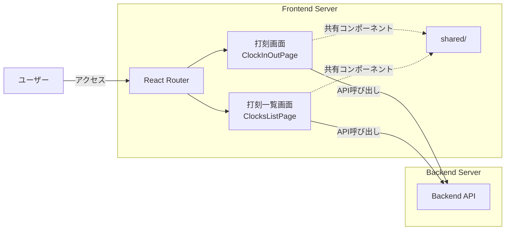

# フロントエンド

React + Viteで実装した勤怠管理システムのフロントエンド

## 構成図



## 技術スタック

- React 18.3.1
- Vite 6.0.3
- TypeScript 5.7.2
- React Router 6.26.2
- Vitest 2.1.8 + React Testing Library 16.1.0
- Playwright 1.48.0
- ESLint 9.15.0

## プロジェクト構造

```text
apps/frontend/
├── src/
│   ├── ClockInOutPage/
│   │   ├── page-objects/        # E2Eテスト用ページオブジェクト
│   │   ├── ClockInOutPage.tsx
│   │   └── ...
│   ├── ClocksListPage/
│   │   ├── page-objects/        # E2Eテスト用ページオブジェクト
│   │   ├── ClocksListPage.tsx
│   │   └── ...
│   ├── shared/
│   │   ├── api/                 # API通信
│   │   ├── types/               # 型定義
│   │   └── constants/           # 定数
│   ├── App.tsx
│   └── main.tsx
├── vite.config.ts
└── playwright.config.ts
```

## テスト

### ユニットテスト

Vitest + React Testing Libraryを使用したコンポーネントテスト

```bash
npm test
```

### E2Eテスト

Playwrightを使用したブラウザテスト。ページオブジェクトパターンを採用しています。

```bash
npm run test:integration
```

#### ページオブジェクト

テストコードの保守性向上のため、ページオブジェクトパターンを使用しています。

配置場所: 各コンポーネントの`page-objects/`ディレクトリ

- `ClockInOutPage/page-objects/ClockInOutPage.ts`: 打刻画面のページオブジェクト
- `ClocksListPage/page-objects/ClocksListPage.ts`: 打刻一覧画面のページオブジェクト

詳細は[E2E README](../../../test/e2e/README.md)を参照してください。

#### スクリーンショット

E2Eテストではスクリーンショットを生成し、画面の表示を記録します。

スクリーンショットは`.gitignore`で除外され、リポジトリには含まれません。

**ローカル環境での開発**:

初回実行時はスクリーンショットを生成:

```bash
npm run test:integration -- --update-snapshots
```

既存のスクリーンショットと比較して変更を確認:

```bash
npm run test:integration
```

スクリーンショットを意図的に更新:

```bash
npm run test:visual:update
```

**CI環境**: CI環境では常にスクリーンショットを新規生成します。これにより、各実行時点での画面表示が記録されます。

## コマンド

| コマンド                   | 説明                                        |
| -------------------------- | ------------------------------------------- |
| `npm run dev`              | 開発サーバー起動（<http://localhost:5173>） |
| `npm run build`            | プロダクションビルド                        |
| `npm test`                 | ユニットテスト                              |
| `npm run test:integration` | E2Eテスト                                   |
| `npm run lint`             | Lintチェック                                |
