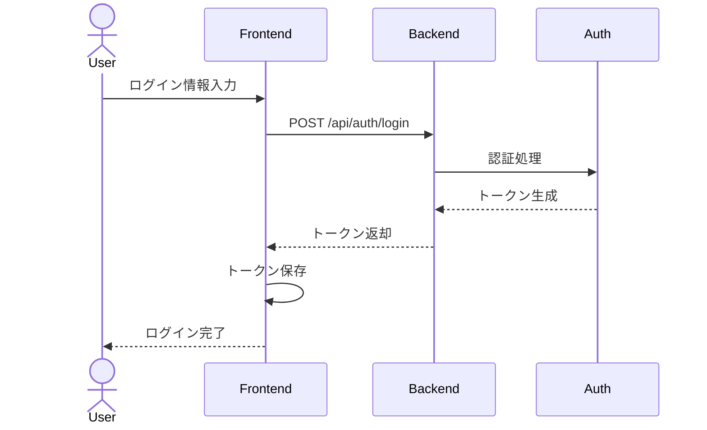

# 認証機能の実装

## 要求仕様

フロントエンドアプリケーションにユーザー認証機能を実装する。

### 機能要件

- ユーザーがメールアドレスとパスワードでログインできる
- ログイン後、トークンをローカルストレージに保存する
- ログアウト機能を提供する
- 認証状態に応じて表示を切り替える

### 非機能要件

- セキュアな通信（HTTPS）
- トークンの有効期限管理
- レスポンシブデザイン対応

## 実現案

### アーキテクチャ



### 技術スタック

- React
- React Router
- JWT認証
- Axios（HTTP通信）

## 実装方式

### ファイル構成

```
apps/frontend/src/
├── components/
│   ├── LoginForm.jsx
│   └── LogoutButton.jsx
├── contexts/
│   └── AuthContext.jsx
├── hooks/
│   └── useAuth.js
├── services/
│   └── authService.js
└── utils/
    └── tokenStorage.js
```

### 実装手順

1. 認証コンテキストの作成
   - AuthContextとProviderの実装
   - グローバル認証状態の管理
2. トークン管理ユーティリティの作成
   - ローカルストレージへの保存/取得/削除
3. 認証APIサービスの実装
   - ログインAPIの呼び出し
   - エラーハンドリング
4. ログインフォームコンポーネントの作成
   - フォームバリデーション
   - 送信処理
5. ログアウトボタンコンポーネントの作成
6. ルーティングの保護
   - 認証が必要なページの保護

## タスク一覧

- [ ] 認証コンテキストの実装
  - AuthContext.jsxの作成
  - useAuthフックの作成
- [ ] トークン管理の実装
  - tokenStorage.jsの作成
  - トークンの保存/取得/削除機能
- [ ] 認証APIサービスの実装
  - authService.jsの作成
  - loginメソッドの実装
  - logoutメソッドの実装
- [ ] UIコンポーネントの実装
  - LoginForm.jsxの作成
  - LogoutButton.jsxの作成
- [ ] ルーティングの保護
  - PrivateRouteコンポーネントの作成
- [ ] テストの作成
  - 認証フローのテスト
  - コンポーネントのテスト

## 進行状況

### 2026-01-13
- タスク一覧を作成
- 実装方式を決定

### 今後の予定
- 認証コンテキストの実装から着手予定
