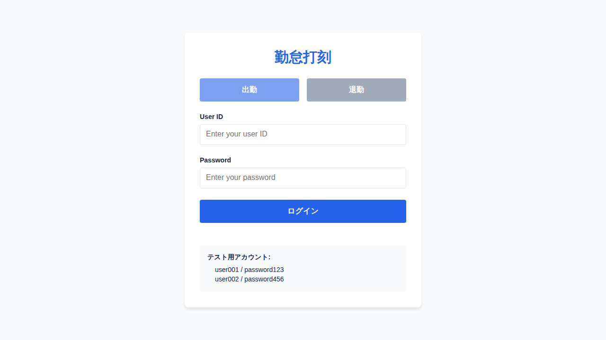

# 打刻画面仕様

## 概要

ユーザーが出勤・退勤の打刻を行うための画面です。認証機能と打刻ボタンを備えています。

## スクリーンショット



## 画面パス

- **URL**: `/`
- **ページコンポーネント**: `ClockInOutPage.tsx`

## 機能仕様

### 1. 入力フォーム

#### ユーザーID入力
- **項目名**: User ID
- **入力タイプ**: テキスト
- **必須**: はい
- **バリデーション**: 未入力時にエラーメッセージ表示

#### パスワード入力
- **項目名**: Password
- **入力タイプ**: パスワード（マスク表示）
- **必須**: はい
- **バリデーション**: 未入力時にエラーメッセージ表示
- **セキュリティ**: 打刻成功後に自動クリア

### 2. 打刻ボタン

#### 出勤ボタン
- **ラベル**: 出勤
- **スタイル**: プライマリーボタン（青）
- **動作**: clock-in APIを呼び出し
- **無効化**: 処理中（loading状態）

#### 退勤ボタン
- **ラベル**: 退勤
- **スタイル**: セカンダリーボタン（グレー）
- **動作**: clock-out APIを呼び出し
- **無効化**: 処理中（loading状態）

### 3. バリデーション

#### 未入力チェック
- **タイミング**: ボタンクリック時
- **条件**: ユーザーIDまたはパスワードが空
- **エラーメッセージ**: "User ID and password are required"
- **表示位置**: フォームとボタンの間

#### 認証エラー
- **タイミング**: API応答時
- **条件**: 認証失敗（success: false）
- **エラーメッセージ**: APIからのメッセージを表示
- **表示スタイル**: 赤背景のエラーメッセージボックス

### 4. 成功メッセージ

- **表示タイミング**: 打刻成功時
- **メッセージ形式**: "Clock in/out successful at [日時]"
- **日時形式**: 日本語ロケール形式（例: 2026/01/11 10:30:00）
- **表示スタイル**: 緑背景の成功メッセージボックス
- **表示期間**: ページ遷移または次の操作まで

### 5. ヘルプ情報

#### テストアカウント情報
- **表示位置**: フォーム下部
- **内容**:
  - user001 (password123)
  - user002 (password456)
- **目的**: 開発・テスト時の利便性向上

### 6. ナビゲーション

#### 打刻一覧へのリンク
- **ラベル**: "打刻一覧を見る →"
- **リンク先**: `/records`
- **表示位置**: ページ最下部

## UI/UX設計

### レイアウト
- **配置**: 画面中央に配置
- **最大幅**: 500px
- **背景**: 白いカードスタイル
- **シャドウ**: 軽いドロップシャドウ（0 4px 6px rgba(0,0,0,0.1)）

### レスポンシブ対応
- **パディング**: 画面サイズに応じて2rem
- **モバイル対応**: 幅100%で表示

### カラースキーム
- **プライマリー**: #2563eb（青）
- **セカンダリー**: #64748b（グレー）
- **成功**: #16a34a（緑）
- **エラー**: #dc2626（赤）
- **テキスト**: #1e293b（ダークグレー）

## API連携

### エンドポイント
- **メソッド**: `mockApi.clockInOut(request)`
- **リクエスト型**: `ClockInOutRequest`
```typescript
interface ClockInOutRequest {
  userId: string;
  password: string;
  type: 'clock-in' | 'clock-out';
}
```

### レスポンス型
```typescript
interface ClockInOutResponse {
  success: boolean;
  record?: ClockRecord;
  message?: string;
}
```

### エラーハンドリング
1. **ネットワークエラー**: "An error occurred. Please try again."
2. **認証エラー**: APIからのメッセージ表示
3. **その他のエラー**: 汎用エラーメッセージ表示

## 状態管理

### State変数
- `userId: string` - ユーザーID入力値
- `password: string` - パスワード入力値
- `loading: boolean` - API呼び出し中フラグ
- `message: { type: 'success' | 'error'; text: string } | null` - メッセージ表示

### 状態遷移
1. **初期状態**: 全フィールド空、loading=false
2. **処理中**: loading=true、ボタン無効化
3. **成功**: loading=false、成功メッセージ表示、パスワードクリア
4. **失敗**: loading=false、エラーメッセージ表示

## テストアカウント

| ユーザーID | パスワード | 用途 |
|-----------|----------|------|
| user001 | password123 | 正常系テスト |
| user002 | password456 | 正常系テスト |

## 関連ファイル

- `ClockInOutPage.tsx` - コンポーネント本体
- `ClockInOutPage.css` - スタイル定義
- `ClockInOutPage.test.tsx` - 単体テスト（5テスト）
- `ClockInOutPage.stories.tsx` - Storybookストーリー

## 今後の拡張予定

- [ ] 生体認証（指紋認証、顔認証）対応
- [ ] 位置情報による打刻制限
- [ ] オフライン打刻対応
- [ ] 打刻履歴の簡易表示
