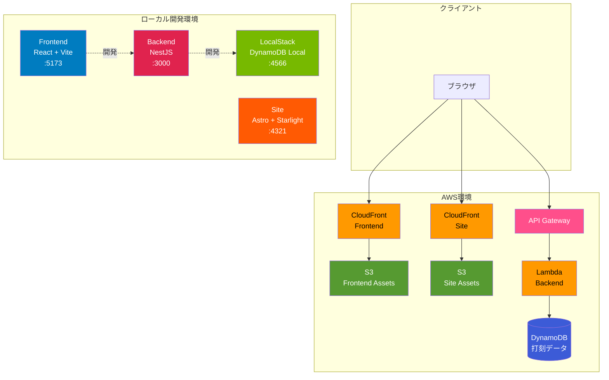

# 勤怠管理システム アーキテクチャ仕様

## システム概要

勤怠管理システム（Attendance Kit）は、従業員の出退勤打刻、勤怠データの記録・管理を行うWebアプリケーションです。

## システム構成



## アーキテクチャ

### モノレポ構造

```
attendance-kit/
├── apps/
│   ├── frontend/              # フロントエンドアプリケーション
│   ├── backend/               # バックエンドアプリケーション
│   └── site/                  # 製品サポートサイト
├── packages/
│   ├── types/                 # 共有型定義
│   └── config/                # 共通設定
└── infrastructure/
    └── deploy/                # AWS CDKデプロイコード
        └── lib/
            └── constructs/
                ├── database-construct.ts
                ├── frontend-construct.ts
                ├── site-construct.ts
                └── backend-construct.ts
```

### 技術スタック

| レイヤー | 技術 | バージョン |
|---------|------|----------|
| **フロントエンド** | React | 18.2.0 |
| | TypeScript | 5.3.3 |
| | Vite | 5.0.11 |
| **バックエンド** | NestJS | 10.3.0 |
| | TypeScript | 5.3.3 |
| | Express | 4.x |
| | AWS SDK | 3.x |
| **データベース** | DynamoDB | - |
| **サポートサイト** | Astro | 4.16.19 |
| | Starlight | 0.29.3 |
| **インフラ** | AWS CDK | 2.x |
| | CloudFront | - |
| | S3 | - |
| | API Gateway | - |
| | Lambda | - |
| **ローカル開発** | LocalStack | 3.x |

## データモデル

### DynamoDBテーブル設計

#### テーブル名: `AttendanceRecords`

**パーティションキー**: `userId` (String)  
**ソートキー**: `timestamp` (String, ISO 8601形式)

**Global Secondary Index**: `DateIndex`
- パーティションキー: `date` (String, YYYY-MM-DD形式)
- ソートキー: `timestamp` (String)

#### アイテム構造

```typescript
{
  userId: string;        // ユーザーID（パーティションキー）
  timestamp: string;     // タイムスタンプ ISO 8601（ソートキー）
  id: string;           // イベントID（UUID）
  type: 'clock-in' | 'clock-out';  // 打刻タイプ
  userName?: string;    // ユーザー名（出勤時のみ）
  date: string;         // 日付 YYYY-MM-DD（GSI用）
}
```

#### データ設計の原則

**1イベント = 1レコード**

- 出勤打刻と退勤打刻は個別のDynamoDBレコードとして保存
- フロントエンドでペアリングして表示用のClockRecordに変換
- タイムスタンプをソートキーとすることで時系列クエリが効率的

### 型定義

#### ClockEvent（DynamoDB保存用）

```typescript
export interface ClockEvent {
  id: string;
  userId: string;
  timestamp: Date;
  type: 'clock-in' | 'clock-out';
  userName?: string;
}
```

#### ClockRecord（フロントエンド表示用）

```typescript
export interface ClockRecord {
  id: string;
  userId: string;
  clockInTime: Date;
  clockOutTime?: Date;
  type: 'clock-in' | 'clock-out';
}
```

## API仕様

### ベースURL

- ローカル開発: `http://localhost:3000`
- 本番環境: `https://api.attendance-kit.example.com`（デプロイ後）

### エンドポイント

#### POST /api/clock-in

出勤打刻を記録します。

**リクエスト**:
```typescript
{
  userId: string;
  userName: string;
}
```

**レスポンス**:
```typescript
{
  success: boolean;
  data?: {
    id: string;
    userId: string;
    clockInTime: Date;
    type: 'clock-in';
  };
  error?: string;
}
```

#### POST /api/clock-out

退勤打刻を記録します。

**リクエスト**:
```typescript
{
  userId: string;
}
```

**レスポンス**:
```typescript
{
  success: boolean;
  data?: {
    id: string;
    userId: string;
    clockInTime: Date;
    clockOutTime: Date;
    type: 'clock-out';
  };
  error?: string;
}
```

#### GET /api/records?userId={userId}

指定ユーザーの打刻履歴を取得します。

**パラメータ**:
- `userId` (required): ユーザーID

**レスポンス**:
```typescript
{
  success: boolean;
  data?: Array<{
    id: string;
    userId: string;
    clockInTime: Date;
    clockOutTime?: Date;
    type: 'clock-in' | 'clock-out';
  }>;
  error?: string;
}
```

## フロントエンド設計

### コンポーネント構成

```
App
├── UserInput          # ユーザーID・名前入力
├── ClockInButton      # 出勤打刻ボタン
├── ClockOutButton     # 退勤打刻ボタン
└── RecordList         # 打刻履歴表示
```

### レスポンシブ対応

| ブレークポイント | 画面サイズ | 対応 |
|----------------|-----------|-----|
| デスクトップ | 1920x1080+ | ✅ |
| タブレット | 1280x1024 | ✅ |
| モバイル | 768px以下 | ✅ |

### カラースキーム

- **プライマリカラー**: #007CC0
- **ホバー**: #0069a3
- **アクティブ**: #005686

## バックエンド設計

### モジュール構成

```
src/
├── app.module.ts           # ルートモジュール
├── main.ts                 # エントリーポイント
└── clock/
    ├── clock.module.ts     # 打刻機能モジュール
    ├── clock.controller.ts # APIコントローラー
    └── clock.service.ts    # ビジネスロジック
```

### データストレージ戦略

**環境変数による切り替え**:

- `DYNAMODB_TABLE_NAME`が設定されている場合: DynamoDBを使用
- 未設定の場合: メモリ内ストアを使用（ローカル開発用）

**LocalStack統合**:

- ローカル開発環境ではLocalStackのDynamoDBを使用
- 環境変数`AWS_ENDPOINT_URL=http://localhost:4566`で接続

### CORS設定

すべてのオリジンを許可（開発環境）:

```typescript
app.enableCors({
  origin: '*',
  methods: 'GET,HEAD,PUT,PATCH,POST,DELETE',
  credentials: true,
});
```

## インフラストラクチャ

### AWS CDKスタック構成

#### AttendanceKitStack（環境別）

- **Dev**: `AttendanceKit-Dev-Stack`
- **Staging**: `AttendanceKit-Staging-Stack`
- **Prod**: `AttendanceKit-Prod-Stack`

#### リソース構成

**DatabaseConstruct**:
- DynamoDBテーブル
- Global Secondary Index

**FrontendConstruct**:
- S3バケット（静的ホスティング）
- CloudFrontディストリビューション
- OAC（Origin Access Control）

**BackendConstruct**:
- Lambda関数（NestJSランタイム）
- API Gateway（REST API）
- Lambda実行ロール

**SiteConstruct**:
- S3バケット（静的ホスティング）
- CloudFrontディストリビューション
- OAC

### デプロイフロー

```bash
# 1. アプリケーションをビルド
npm run build

# 2. CDKでインフラをデプロイ
cd infrastructure/deploy
cdk deploy AttendanceKit-Dev-Stack --context environment=dev
```

## ローカル開発環境

### LocalStack設定

**docker-compose.yml**で以下のサービスを起動:

- DynamoDB
- S3（将来的に使用）
- Lambda（将来的に使用）

**ポート**: 4566

### 開発サーバー

| サービス | ポート | URL |
|---------|--------|-----|
| Frontend | 5173 | http://localhost:5173 |
| Backend | 3000 | http://localhost:3000 |
| Site | 4321 | http://localhost:4321 |
| LocalStack | 4566 | http://localhost:4566 |

### セットアップ手順

```bash
# 1. 依存関係インストール
npm ci

# 2. LocalStackを起動
npm run localstack:start

# 3. DynamoDBテーブルを作成
npm run dynamodb:setup

# 4. 開発サーバーを起動
npm run dev
```

## セキュリティ

### 認証・認可

**Phase 1（MVP）**: 認証なし
- ユーザーIDは自由入力
- 開発・検証目的のみ

**Phase 2（予定）**: AWS Cognito統合
- OIDC認証
- JWTトークン検証
- ロールベースアクセス制御

### データ保護

- HTTPS通信（CloudFront経由）
- DynamoDBの暗号化（AWS KMS）
- 最小権限の原則（IAMロール）

## 運用

### モニタリング

- CloudWatch Logs（Lambda実行ログ）
- CloudWatch Metrics（API Gateway、Lambda、DynamoDB）
- X-Ray（分散トレーシング）

### バックアップ

- DynamoDBポイントインタイムリカバリ（PITR）
- 日次バックアップ

## パフォーマンス

### 目標指標

| メトリック | 目標値 |
|-----------|--------|
| API応答時間 | < 500ms |
| フロントエンド初期ロード | < 2秒 |
| CloudFront キャッシュヒット率 | > 80% |

### スケーラビリティ

- Lambda: 自動スケーリング
- DynamoDB: On-Demand課金モデル
- CloudFront: グローバルエッジ配信

## 今後の拡張

### Phase 2: 認証・認可
- AWS Cognito統合
- ロールベースアクセス制御
- 管理者機能

### Phase 3: 機能拡張
- 休暇申請
- 勤怠集計・レポート
- 承認ワークフロー
- メール通知

### Phase 4: 運用改善
- CI/CDパイプライン
- 自動テスト
- 監視・アラート強化
- パフォーマンス最適化
