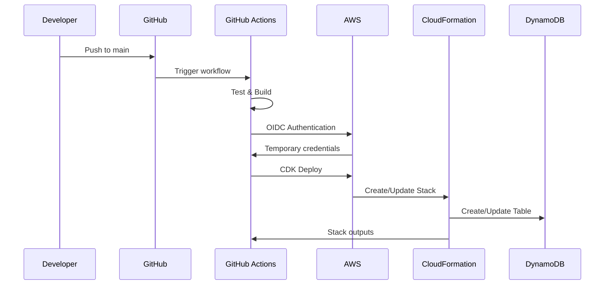
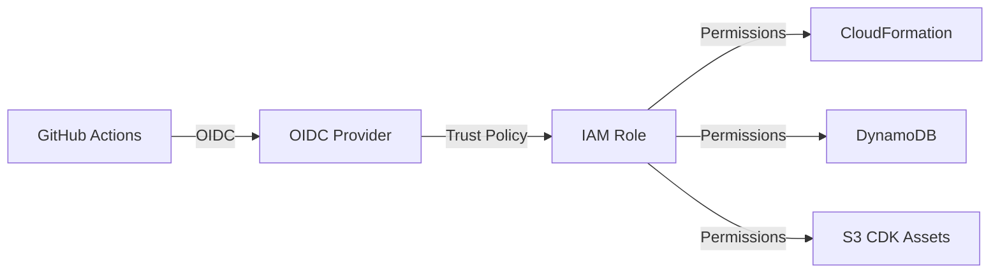

# CI/CD デプロイメント戦略

## アーキテクチャ概要

### デプロイメントフロー

## セキュリティアーキテクチャ

### OIDC認証

### セキュリティ原則

- 最小権限の原則
- リポジトリ制限（特定リポジトリのみがロール引き受け可能）
- 一時認証情報（1時間で自動失効）
- データ暗号化（保存時・転送時）

## デプロイメント戦略

### 自動デプロイ

`apps/`または`infrastructure/`配下の対象ファイルが`main`ブランチにマージされた時に自動実行 (apps/websiteは対象外)

### 環境管理

各環境は独立したAWSリソースを持ちます:
- eva (AWS環境)
- stg (AWS環境、未実装)
- prod (AWS環境、未実装)

ローカル環境:
- dev (ローカル開発環境)
- test (ローカルテスト環境)
