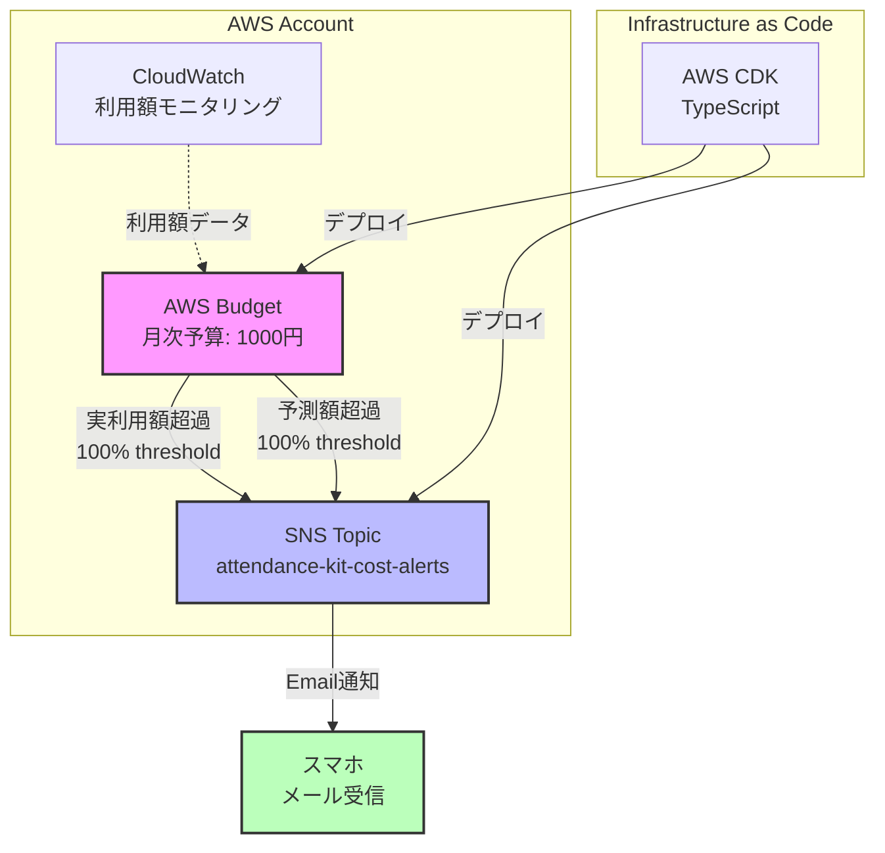
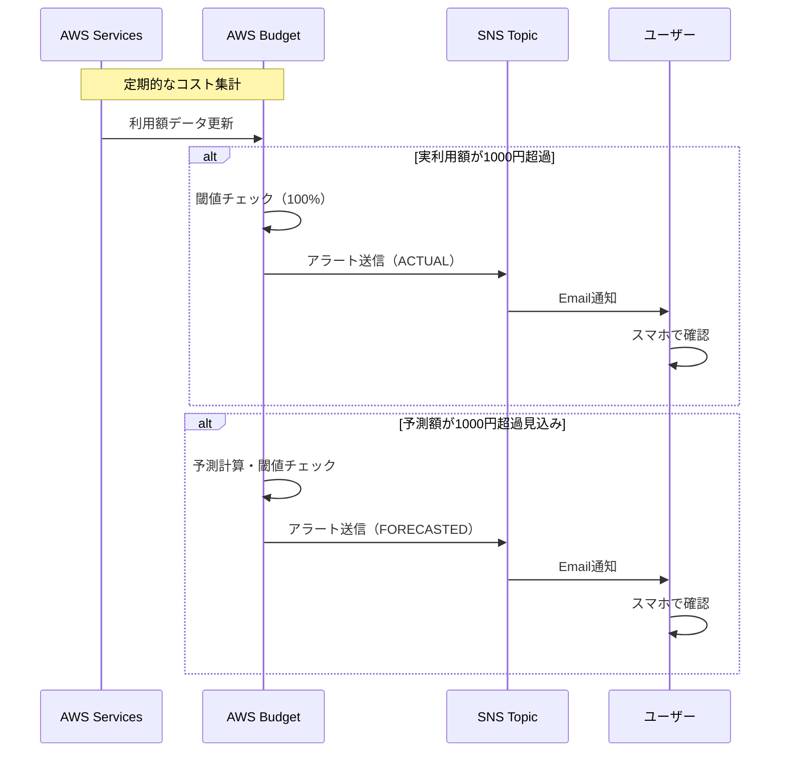

# AWS利用金額アラート - アーキテクチャ設計

## 概要

AWSアカウント全体のコスト監視を実現する予算アラート機能。月次予算1000円を設定し、実利用額および予測額が予算を超過した際にSNS経由でメール通知を送信する。

## システム構成

### コンポーネント構成図



### リソース階層

```text
AttendanceKit-Account-Stack (アカウント単位)
├── CostBudgetConstruct
│   ├── SNS Topic (attendance-kit-cost-alerts)
│   │   └── Email Subscription
│   └── AWS Budget (attendance-kit-account-monthly-budget)
│       ├── 実利用額アラート (ACTUAL, 100%)
│       └── 予測額アラート (FORECASTED, 100%)

AttendanceKit-Dev-Stack (環境単位)
└── DynamoDB Clock Table
```

## 技術仕様

### AWS Budget設定

| 項目 | 値 |
|------|-----|
| 予算名 | attendance-kit-account-monthly-budget |
| 予算タイプ | COST |
| 期間単位 | MONTHLY |
| 予算額 | 1000円 |
| 通貨 | JPY |

### アラート設定

#### 実利用額アラート

- **通知タイプ**: ACTUAL
- **閾値**: 100%（1000円）
- **比較演算子**: GREATER_THAN
- **配信先**: SNS Topic

#### 予測額アラート

- **通知タイプ**: FORECASTED
- **閾値**: 100%（1000円）
- **比較演算子**: GREATER_THAN
- **配信先**: SNS Topic

### SNS Topic

| 項目 | 値 |
|------|-----|
| トピック名 | attendance-kit-cost-alerts |
| 表示名 | AWS Cost Budget Alerts |
| プロトコル | Email |
| サブスクリプション | 環境変数 COST_ALERT_EMAIL から設定 |

### IAMポリシー

AWS Budgets サービスに対してSNS Topic へのパブリッシュ権限を付与:

```json
{
  "Effect": "Allow",
  "Principal": {
    "Service": "budgets.amazonaws.com"
  },
  "Action": "SNS:Publish",
  "Resource": "<SNS Topic ARN>"
}
```

## データフロー



## CDK実装

### スタック構成

```typescript
// アカウントレベルスタック
export class AttendanceKitAccountStack extends cdk.Stack {
  public readonly costBudget: CostBudgetConstruct;
  
  constructor(scope: Construct, id: string, props: AttendanceKitAccountStackProps) {
    // CostBudgetConstructをインスタンス化
    this.costBudget = new CostBudgetConstruct(this, 'CostBudget', {
      budgetName: 'attendance-kit-account-monthly-budget',
      budgetAmountYen: 1000,
      emailEndpoint: props.alertEmail,
    });
  }
}

// Construct
export class CostBudgetConstruct extends Construct {
  public readonly snsTopic: sns.Topic;
  public readonly budget: budgets.CfnBudget;
  
  // SNS Topic作成
  // AWS Budget作成（実利用額・予測額アラート）
  // IAMポリシー設定
}
```

### ファイル構成

```text
infrastructure/deploy/
├── lib/
│   ├── attendance-kit-account-stack.ts    # アカウントスタック
│   ├── attendance-kit-stack.ts            # 環境スタック（既存）
│   └── constructs/
│       └── cost-budget.ts                 # 予算アラートConstruct
├── test/
│   ├── attendance-kit-account-stack.test.ts
│   ├── cost-budget.test.ts
│   └── attendance-kit-stack.test.ts       # 既存
└── bin/
    └── app.ts                              # エントリーポイント

.github/workflows/
├── deploy-environment-stack.yml            # 環境スタックデプロイ
└── deploy-account-stack.yml                # アカウントスタックデプロイ

└── bin/
    └── app.ts                              # エントリーポイント
```

## コスト分析

### 使用料金

| サービス | 使用量 | 料金 |
|---------|--------|------|
| AWS Budget | 1個 | 無料（最初の2個まで） |
| SNS Email通知 | ~4件/月 | 無料（1,000件/月まで） |
| **合計** | - | **¥0** |

### コスト最適化

- CloudWatchアラーム不使用（追加コスト回避）
- アカウント単位で1つのBudgetのみ作成
- Email通知のみ（無料枠内）

## セキュリティ

### 最小権限の原則

- AWS Budgets サービスのみに SNS Publish 権限
- 他のサービスからのアクセスは拒否

### 通知内容

- アカウントID: 含む
- 利用額情報: 含む
- アクセスキー等の機密情報: 含まない

## 運用

### デプロイ

#### GitHub Actions による自動デプロイ

**アカウントスタック**:

- ワークフロー: `deploy-account-stack.yml`
- トリガー: アカウントスタック関連ファイルの変更
- 手動実行: GitHub Actions タブから実行可能
- 必須環境変数: `COST_ALERT_EMAIL`（GitHub Secrets）

**環境スタック**:

- ワークフロー: `deploy-environment-stack.yml`
- トリガー: アプリケーション/環境スタック関連ファイルの変更（apps/website除外）
- 手動実行: GitHub Actions タブから環境を選択して実行可能

#### ローカルからのデプロイ

アカウントスタックを1回のみデプロイ:

```bash
cd infrastructure/deploy
COST_ALERT_EMAIL=email@example.com npm run cdk deploy AttendanceKit-Account-Stack
```

環境スタックをデプロイ:

```bash
cd infrastructure/deploy
ENVIRONMENT=dev npm run cdk deploy AttendanceKit-Dev-Stack
```

### モニタリング

- AWS Budgetコンソールで予算進捗を確認
- SNS配信履歴でアラート送信状況を確認
- CloudWatch Logsで詳細ログを確認（必要時）

### トラブルシューティング

#### 通知が届かない場合

1. SNSサブスクリプションの確認状態をチェック
2. Email確認リンクをクリック済みか確認
3. SNS Topic Policyの確認

#### 予算超過の対処

1. 不要なリソースの削除
2. 予算額の再検討
3. コスト最適化の実施

## 拡張性

### 将来対応

- **Mobile Push通知**: AWS SNS Mobile Push対応
- **複数通知先**: Email + SMS + Mobile Push
- **カスタム通知**: Lambda経由でSlack等に通知
- **詳細レポート**: Cost ExplorerとAthenaでコスト分析

### 制約事項

- 予算は月単位のみ（日次・週次不可）
- 通知は予算超過後（事前防止不可）
- AWSアカウント単位（プロジェクト別分離不可）

## 技術スタック選定理由

### AWS Budget

**選定理由**:

- 予測アラート機能が標準搭載
- 無料枠で利用可能
- SNSと直接統合可能

**代替案との比較**:

- CloudWatchアラーム: 予測機能なし、追加コスト
- Cost Anomaly Detection: 異常検知のみ、予算管理不可
- サードパーティツール: 追加コスト、複雑性増加

### SNS

**選定理由**:

- Email通知が無料枠で利用可能
- AWS Budgetとネイティブ統合
- Mobile Push等への拡張が容易

**代替案との比較**:

- Lambda + SES: 実装複雑、管理コスト増
- EventBridge + Lambda: オーバーエンジニアリング
- サードパーティサービス: 追加コスト

### AWS CDK (TypeScript)

**選定理由**:

- 既存インフラストラクチャとの統合が容易
- TypeScriptで型安全な実装
- テストが容易

## 参照

- AWS Budget公式ドキュメント: <https://docs.aws.amazon.com/cost-management/latest/userguide/budgets-managing-costs.html>
- SNS公式ドキュメント: <https://docs.aws.amazon.com/sns/latest/dg/welcome.html>
- 実装コード: `infrastructure/deploy/lib/`
