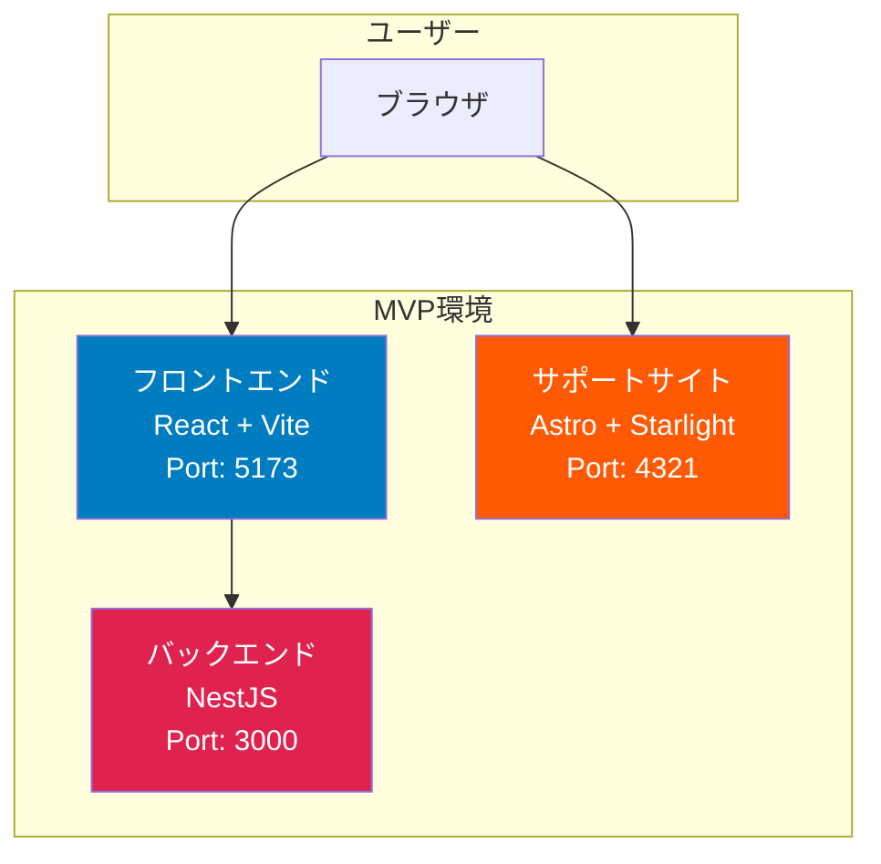

# MVP モノレポ構成 実装ドキュメント

## 概要

勤怠管理システムの最小限の実行可能製品（MVP）として、以下の構成を実装しました。

- 勤怠アプリ（フロントエンド: React、バックエンド: NestJS）
- 製品サポートサイト（Astro + Starlight）
- 共通パッケージ（型定義、設定）

## アーキテクチャ

### システム構成



### モノレポ構造

```
attendance-kit/
├── apps/                       # アプリケーション
│   ├── frontend/    # React フロントエンド
│   └── backend/     # NestJS バックエンド
├── sites/                      # 静的サイト
│   └── product-support/       # Astro サポートサイト
├── packages/                   # 共通パッケージ
│   ├── types/                 # 型定義
│   └── config/                # 設定
└── package.json               # ルート設定
```

## 実装詳細

### 共通パッケージ

#### @attendance-kit/types

勤怠システム全体で使用する型定義を提供:

```typescript
// 主要な型定義
export interface ClockRecord {
  id: string;
  userId: string;
  clockInTime: Date;
  clockOutTime?: Date;
  type: 'clock-in' | 'clock-out';
}

export interface ApiResponse<T> {
  success: boolean;
  data?: T;
  error?: string;
}
```

#### @attendance-kit/config

共通の設定を提供:

- Viteベース設定
- プライマリカラー: #007CC0
- ビルド最適化設定

### フロントエンド

#### 技術スタック

- React 18.2.0
- TypeScript 5.3.3
- Vite 5.0.11
- CSS Modules

#### 主要コンポーネント

1. **UserInput**: ユーザーID・名前入力
2. **ClockInButton**: 出勤打刻ボタン
3. **ClockOutButton**: 退勤打刻ボタン
4. **RecordList**: 打刻履歴表示

#### レスポンシブデザイン

```css
/* ブレークポイント */
- デスクトップ: 1920x1080+ （デフォルト）
- タブレット: 1280x1024
- モバイル: 768px以下
```

#### カラースキーム

- プライマリ: #007CC0
- ホバー: #0069a3
- アクティブ: #005686

### バックエンド

#### 技術スタック

- NestJS 10.3.0
- TypeScript 5.3.3
- Express

#### API エンドポイント

```typescript
// 出勤打刻
POST /api/clock-in
Body: { userId: string, userName: string }
Response: ApiResponse<ClockRecord>

// 退勤打刻
POST /api/clock-out
Body: { userId: string }
Response: ApiResponse<ClockRecord>

// 打刻履歴取得
GET /api/records?userId={userId}
Response: ApiResponse<ClockRecord[]>
```

#### データストレージ

MVP版ではメモリ内配列を使用:

```typescript
private records: ClockRecord[] = [];
```

⚠️ サーバー再起動でデータが消失します。将来的にDynamoDBに移行予定。

### サポートサイト

#### 技術スタック

- Astro 4.1.2
- Starlight 0.17.1
- Markdown

#### コンテンツ構成

1. **概要**: システムの説明と主な機能
2. **使い方ガイド**: 出退勤打刻の手順
3. **FAQ**: よくある質問

#### カスタマイズ

- カスタムカラーテーマ（#007CC0）
- 日本語ロケール設定
- カスタムCSS

## 開発ワークフロー

### セットアップ

```bash
# 依存関係インストール
npm install

# すべての開発サーバー起動
npm run dev

# 個別起動
npm run dev:frontend  # http://localhost:5173
npm run dev:backend   # http://localhost:3000
npm run dev:site      # http://localhost:4321
```

### ビルド

```bash
# すべてビルド
npm run build

# 個別ビルド
npm run build:frontend  # -> apps/frontend/dist
npm run build:backend   # -> apps/backend/dist
npm run build:site      # -> sites/product-support/dist
```

## テスト結果

### ビルド検証

| パッケージ | ステータス | 備考 |
|----------|----------|-----|
| types | ✅ 成功 | - |
| config | ✅ 成功 | - |
| frontend | ✅ 成功 | dist生成確認済み |
| backend | ✅ 成功 | dist生成確認済み |
| site | ⚠️ 既知の問題 | 開発サーバーは正常動作 |

### 機能検証

| 機能 | ステータス | 備考 |
|-----|----------|-----|
| 出勤打刻 | ✅ 動作確認 | API/UI両方OK |
| 退勤打刻 | ✅ 動作確認 | API/UI両方OK |
| 履歴表示 | ✅ 動作確認 | リアルタイム更新OK |
| レスポンシブ | ✅ 動作確認 | 各ブレークポイントOK |
| CORS | ✅ 動作確認 | クロスオリジン対応OK |

### セキュリティ検証

- ✅ CodeQLスキャン: 脆弱性0件
- ⚠️ npm audit: 17件（開発依存関係のみ、本番コード影響なし）

## 既知の問題

### 1. サポートサイトのビルド失敗

**問題**: Astro/Starlightのビルドが `Cannot read properties of undefined (reading 'some')` で失敗

**影響**: 本番デプロイに影響

**回避策**: 開発サーバーは正常動作、Astro/Starlightのバージョンアップで解決予定

**優先度**: 中

### 2. npm audit脆弱性

**問題**: 開発依存関係に17件の脆弱性

**内訳**:
- 4 low
- 5 moderate
- 8 high

**影響**: 本番ビルドには影響なし（dev依存関係のみ）

**対応**: パッケージの更新で解決予定

**優先度**: 低

## パフォーマンス

### ビルド時間

- フロントエンド: ~1秒
- バックエンド: ~0.5秒
- 合計: ~1.5秒

### バンドルサイズ

- フロントエンド: 145KB (gzip: 47KB)
- CSS: 3.6KB (gzip: 1.2KB)

## 今後の開発ロードマップ

### Phase 2: データベース統合

- [ ] DynamoDB テーブル設計
- [ ] バックエンドのDynamoDB統合
- [ ] データマイグレーション機能

### Phase 3: 認証機能

- [ ] AWS Cognito セットアップ
- [ ] OIDCプロバイダー統合
- [ ] フロントエンド認証フロー実装
- [ ] バックエンド認証ミドルウェア

### Phase 4: CI/CD

- [ ] GitHub Actions ワークフロー
- [ ] 自動ビルド・テスト
- [ ] 自動デプロイ（CDK）

### Phase 5: 機能拡張

- [ ] 休暇申請機能
- [ ] 勤怠集計・レポート
- [ ] 管理者ダッシュボード
- [ ] メール通知

## 参考資料

### 仕様書

- [spec.md](../specs/3-mvp-monorepo-structure/spec.md)
- [plan.md](../specs/3-mvp-monorepo-structure/plan.md)
- [tasks.md](../specs/3-mvp-monorepo-structure/tasks.md)

### パッケージREADME

- [フロントエンド](../apps/frontend/README.md)
- [バックエンド](../apps/backend/README.md)
- [サポートサイト](../sites/product-support/README.md)
- [型定義](../packages/types/README.md)
- [共通設定](../packages/config/README.md)

### 外部リンク

- [React](https://react.dev/)
- [NestJS](https://nestjs.com/)
- [Astro](https://astro.build/)
- [Starlight](https://starlight.astro.build/)
- [Vite](https://vitejs.dev/)

## まとめ

MVP版として、勤怠管理の基本機能（出退勤打刻、履歴表示）を持つモノレポ構成が完成しました。

**達成した成果**:
- ✅ 保守性の高いモノレポ構成
- ✅ 共通型定義による型安全性
- ✅ レスポンシブ対応UI
- ✅ RESTful API
- ✅ 製品ドキュメント

**次のステップ**:
- データベース統合
- 認証機能追加
- CI/CDパイプライン構築

このMVPをベースに、段階的に機能を追加していきます。
