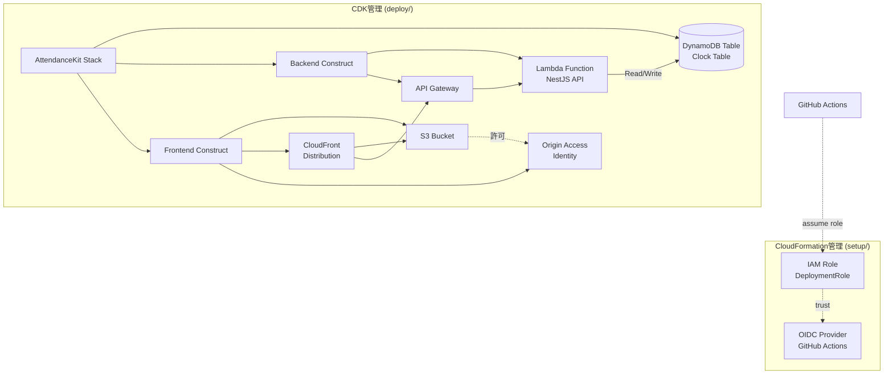

# Infrastructure

AWS CDKを使用したDynamoDB Clock Tableのインフラストラクチャコードです。

## 構成図



## 📋 前提条件

- Node.js 24以上
- AWS CLI v2
- AWSアカウント
- GitHub Actions用のAWS IAMロール設定（OIDC経由）

## 🏗️ 構成

このインフラストラクチャには以下が含まれます：

### アカウントレベルリソース（account/ディレクトリ）
- **AWS Budget**: 月次コスト予算とアラート
- **SNS Topic**: コストアラート通知用

### 環境レベルリソース（deploy/ディレクトリ）
- **DynamoDB Table**: `attendance-kit-{environment}-clock`
  - Partition Key: `userId` (String)
  - Sort Key: `timestamp` (String, ISO 8601形式)
  - Global Secondary Index: `DateIndex` (date + timestamp)
  - 課金モード: Pay-Per-Request
  - Point-in-Time Recovery有効
  - AWS管理キー暗号化

- **Backend API**
  - Lambda関数: Node.js 24.x
  - API Gateway: REST API
  - DynamoDBテーブルへのアクセス権限

- **Frontend**
  - S3バケット: 静的ファイルホスティング
  - CloudFront: CDN配信
  - Origin Access Identity: S3への安全なアクセス
  - API Gateway統合: `/api/*` パスでバックエンドAPIにルーティング

### CloudFormation管理（setup/ディレクトリ）
- **OIDC Provider**: GitHub Actions用
- **IAM Role**: GitHub ActionsがAWSリソースにアクセスするためのロール

## 🚀 初回セットアップ

詳細は [setup/README.md](setup/README.md) を参照してください。

## 💻 ローカル開発

### アカウントスタック

#### 依存関係のインストール

```bash
cd infrastructure/account
npm install
```

#### ビルド

```bash
npm run build
```

#### テスト実行

```bash
npm test
```

### 環境スタック

#### 依存関係のインストール

```bash
cd infrastructure/deploy
npm install
```

#### ビルド

```bash
npm run build
```

#### テスト実行

```bash
npm test
```

### CDK Synth（CloudFormationテンプレート生成）

```bash
# アカウントスタック
cd infrastructure/account
npx cdk synth

# dev環境用
cd infrastructure/deploy
npx cdk synth --context environment=dev

# staging環境用
npx cdk synth --context environment=staging
```

### ローカルからのデプロイ

```bash
export AWS_PROFILE=your-profile

# アカウントスタック（初回のみ）
cd infrastructure/account
npx cdk bootstrap
export COST_ALERT_EMAIL=your-email@example.com
npx cdk deploy

# 環境スタック
cd infrastructure/deploy
npx cdk bootstrap --context environment=dev  # 初回のみ
npx cdk deploy --context environment=dev
```

## 🔄 デプロイフロー

`infrastructure/`配下のファイルを変更し`main`ブランチにマージすると、GitHub Actionsが自動的にデプロイします。

## 🧪 テスト

```bash
npm test
```

## 🔍 トラブルシューティング

詳細は [TROUBLESHOOTING.md](TROUBLESHOOTING.md) を参照してください。


