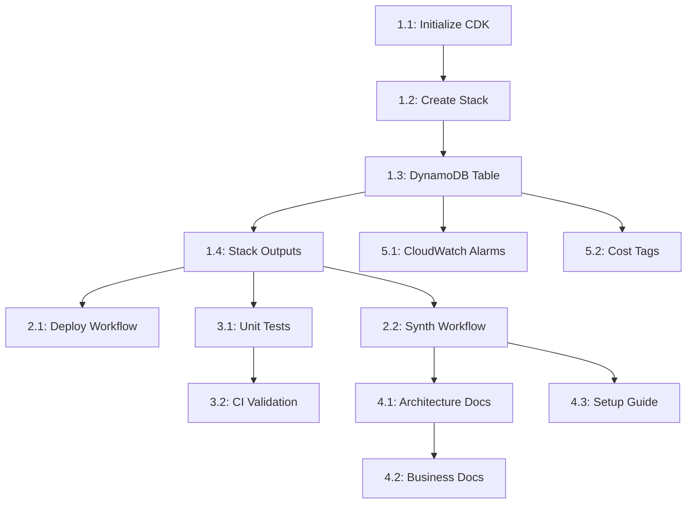

# Implementation Tasks: DynamoDB Clock Table CI/CD Deployment

**Specification**: [spec.md](./spec.md)  
**Implementation Plan**: [plan.md](./plan.md)  
**Status**: Ready for Implementation  
**Created**: 2025-12-25

## Task Breakdown

### Phase 1: Project Setup & CDK Foundation (P1)

#### Task 1.1: Initialize CDK Project Structure
**Priority**: P1  
**Estimated Effort**: 1 hour  
**Dependencies**: None

**Actions**:
- [ ] Create `infrastructure/` directory
- [ ] Initialize CDK TypeScript project with `cdk init app --language typescript`
- [ ] Update `package.json` with Node.js 22 engine requirement
- [ ] Install dependencies: `aws-cdk-lib@^2.x`, `constructs@^10.x`, `@types/node@22.x`
- [ ] Configure `cdk.json` with environment context variables
- [ ] Create `.gitignore` for CDK artifacts (`cdk.out/`, `node_modules/`)

**Acceptance Criteria**:
- CDK project initializes without errors
- `package.json` specifies Node.js 22
- `cdk synth` runs successfully (empty stack)

---

#### Task 1.2: Create Environment-Agnostic CDK Stack
**Priority**: P1  
**Estimated Effort**: 2 hours  
**Dependencies**: Task 1.1

**Actions**:
- [ ] Create `lib/spec-kit-stack.ts` with environment parameter support
- [ ] Implement context parameter reading: `environment = app.node.tryGetContext('environment')`
- [ ] Add environment validation (must be 'dev' or 'staging')
- [ ] Generate dynamic stack name: `SpecKit-${environment}-Stack`
- [ ] Configure stack props (environment, region, description)

**Acceptance Criteria**:
- Stack accepts `--context environment=dev` parameter
- Stack name changes based on environment
- Stack fails gracefully with invalid environment
- `cdk synth --context environment=dev` succeeds

---

#### Task 1.3: Implement DynamoDB Clock Table
**Priority**: P1  
**Estimated Effort**: 2 hours  
**Dependencies**: Task 1.2

**Actions**:
- [ ] Add DynamoDB Table construct to stack
- [ ] Configure table name: `spec-kit-${environment}-clock`
- [ ] Set partition key: `userId` (String)
- [ ] Set sort key: `timestamp` (Number)
- [ ] Configure billing mode: `PAY_PER_REQUEST`
- [ ] Enable point-in-time recovery
- [ ] Set removal policy: `RETAIN`
- [ ] Add server-side encryption (AWS managed)
- [ ] Create Global Secondary Index (GSI):
  - Name: `DateIndex`
  - Partition Key: `date` (String)
  - Sort Key: `timestamp` (Number)
  - Projection: `ALL`

**Acceptance Criteria**:
- Table created with correct partition and sort keys
- GSI configured correctly
- Point-in-time recovery enabled
- Removal policy set to RETAIN
- `cdk synth` shows table resource in CloudFormation template

---

#### Task 1.4: Add CloudFormation Stack Outputs
**Priority**: P1  
**Estimated Effort**: 30 minutes  
**Dependencies**: Task 1.3

**Actions**:
- [ ] Add CfnOutput for table name
- [ ] Add CfnOutput for table ARN
- [ ] Add CfnOutput for GSI name
- [ ] Add CfnOutput for environment
- [ ] Set export names with environment prefix

**Acceptance Criteria**:
- All outputs visible in CloudFormation stack
- Export names include environment
- `cdk synth` shows outputs section

---

### Phase 2: GitHub Actions CI/CD Workflows (P1)

#### Task 2.1: Create CDK Deployment Workflow
**Priority**: P1  
**Estimated Effort**: 3 hours  
**Dependencies**: Task 1.4

**Actions**:
- [ ] Create `.github/workflows/deploy-dev-to-aws.yml`
- [ ] Configure workflow trigger: push to `main` branch, path filter: `infrastructure/**`
- [ ] Add manual workflow dispatch with environment input (default: 'dev')
- [ ] Set up Node.js 22 environment
- [ ] Configure AWS credentials with OIDC
- [ ] Install CDK dependencies: `npm ci`
- [ ] Run CDK bootstrap: `cdk bootstrap --context environment=$ENVIRONMENT`
- [ ] Run CDK deploy: `cdk deploy --context environment=$ENVIRONMENT --require-approval never`
- [ ] Add step to capture and display stack outputs

**Acceptance Criteria**:
- Workflow file validates with GitHub Actions schema
- Manual dispatch allows environment selection
- OIDC authentication configured correctly
- Bootstrap runs before deploy
- Deploy executes without manual approval

---

#### Task 2.2: Create CDK Synth Workflow for Initial Setup
**Priority**: P1  
**Estimated Effort**: 2 hours  
**Dependencies**: Task 1.4

**Actions**:
- [ ] Create `.github/workflows/cdk-synth.yml`
- [ ] Configure manual workflow dispatch only
- [ ] Add environment input parameter
- [ ] Set up Node.js 22 environment
- [ ] Install CDK dependencies: `npm ci`
- [ ] Run CDK synth: `cdk synth --context environment=$ENVIRONMENT`
- [ ] Upload CloudFormation template as artifact (retention: 90 days)
- [ ] Add workflow summary with download instructions

**Acceptance Criteria**:
- Workflow triggered manually only
- CloudFormation template uploaded as artifact
- Template downloadable from GitHub Actions UI
- Workflow completes in under 2 minutes

---

### Phase 3: Testing & Validation (P1)

#### Task 3.1: Create CDK Unit Tests
**Priority**: P1  
**Estimated Effort**: 2 hours  
**Dependencies**: Task 1.4

**Actions**:
- [ ] Install testing dependencies: `jest`, `@types/jest`, `ts-jest`
- [ ] Configure Jest in `package.json`
- [ ] Create `test/spec-kit-stack.test.ts`
- [ ] Test: Stack creates DynamoDB table
- [ ] Test: Table has correct partition and sort keys
- [ ] Test: GSI configured correctly
- [ ] Test: Point-in-time recovery enabled
- [ ] Test: Removal policy is RETAIN
- [ ] Test: Table name includes environment
- [ ] Add test script to `package.json`: `npm test`

**Acceptance Criteria**:
- All tests pass
- Test coverage > 80%
- Tests run in CI workflow

---

#### Task 3.2: Add CDK Synth Validation to CI
**Priority**: P1  
**Estimated Effort**: 1 hour  
**Dependencies**: Task 3.1

**Actions**:
- [ ] Update deploy workflow to run `npm test` before deploy
- [ ] Add `cdk synth` validation step for both dev and staging
- [ ] Add CloudFormation template linting (cfn-lint)
- [ ] Fail workflow if synth produces errors

**Acceptance Criteria**:
- Tests run automatically on push
- Synth validates for multiple environments
- Workflow fails on invalid CloudFormation

---

### Phase 4: Documentation (P2)

#### Task 4.1: Create Architecture Documentation
**Priority**: P2  
**Estimated Effort**: 2 hours  
**Dependencies**: Task 2.2

**Actions**:
- [ ] Create `docs/architecture/dynamodb-clock-table.md`
- [ ] Document table schema with Mermaid ER diagram
- [ ] Document access patterns and query examples
- [ ] Document GSI usage and benefits
- [ ] Include CloudFormation stack structure
- [ ] Add deployment architecture diagram

**Acceptance Criteria**:
- Documentation includes all table attributes
- Access patterns clearly documented
- Diagrams use Mermaid syntax
- Examples include TypeScript/JavaScript code

---

#### Task 4.2: Create Business Documentation
**Priority**: P2  
**Estimated Effort**: 1 hour  
**Dependencies**: Task 4.1

**Actions**:
- [ ] Create `docs/business/clock-table-requirements.md`
- [ ] Document business use cases
- [ ] Define data retention policies
- [ ] Document user stories and acceptance criteria
- [ ] Include cost analysis and projections

**Acceptance Criteria**:
- Business requirements clearly stated
- Use cases documented with examples
- Cost projections included

---

#### Task 4.3: Create Setup and Operations Guide
**Priority**: P2  
**Estimated Effort**: 2 hours  
**Dependencies**: Task 2.2

**Actions**:
- [ ] Create `infrastructure/README.md`
- [ ] Document prerequisites (AWS account, OIDC setup)
- [ ] Document initial setup steps (synth, manual OIDC creation)
- [ ] Document deployment process
- [ ] Document troubleshooting common issues
- [ ] Add rollback procedures
- [ ] Include monitoring and alerting setup

**Acceptance Criteria**:
- Setup guide enables new user to deploy
- All prerequisites documented
- Troubleshooting section covers common errors
- Examples use real commands

---

### Phase 5: Operational Excellence (P2)

#### Task 5.1: Add CloudWatch Alarms
**Priority**: P2  
**Estimated Effort**: 1.5 hours  
**Dependencies**: Task 1.3

**Actions**:
- [ ] Add CloudWatch alarm for read throttle events
- [ ] Add CloudWatch alarm for write throttle events
- [ ] Add CloudWatch alarm for system errors
- [ ] Configure SNS topic for alarm notifications (optional)
- [ ] Set appropriate thresholds and evaluation periods

**Acceptance Criteria**:
- Alarms created in CloudFormation
- Alarms trigger on actual throttle events
- Alarm configuration documented

---

#### Task 5.2: Add Cost Monitoring Tags
**Priority**: P2  
**Estimated Effort**: 30 minutes  
**Dependencies**: Task 1.3

**Actions**:
- [ ] Add cost allocation tags to DynamoDB table
- [ ] Tags: `Environment`, `Project`, `ManagedBy`, `CostCenter`
- [ ] Document tagging strategy in architecture docs

**Acceptance Criteria**:
- Tags visible in AWS Cost Explorer
- Tags applied to all resources
- Tagging strategy documented

---

## Task Summary

**Total Tasks**: 14  
**Priority P1 Tasks**: 10  
**Priority P2 Tasks**: 4  

**Estimated Total Effort**: ~20 hours

### Task Dependencies Graph

## Implementation Order

### Sprint 1: Core Infrastructure (P1)
1. Task 1.1 → 1.2 → 1.3 → 1.4 (Foundation)
2. Task 2.1 → 2.2 (CI/CD)
3. Task 3.1 → 3.2 (Testing)

### Sprint 2: Documentation & Operations (P2)
1. Task 4.1 → 4.2 → 4.3 (Documentation)
2. Task 5.1 → 5.2 (Operations)

## Success Metrics

- [ ] All P1 tasks completed
- [ ] CDK stack deploys successfully to dev environment
- [ ] All tests pass
- [ ] GitHub Actions workflows execute without errors
- [ ] Documentation complete and reviewed
- [ ] CloudWatch alarms configured
- [ ] Cost tags applied

## Notes

- Bootstrap is integrated into deployment workflow (runs before each deploy)
- Single CDK stack file supports multiple environments via context parameter
- No manual approval required for deployments (fully automated)
- CloudFormation review removed per requirements
