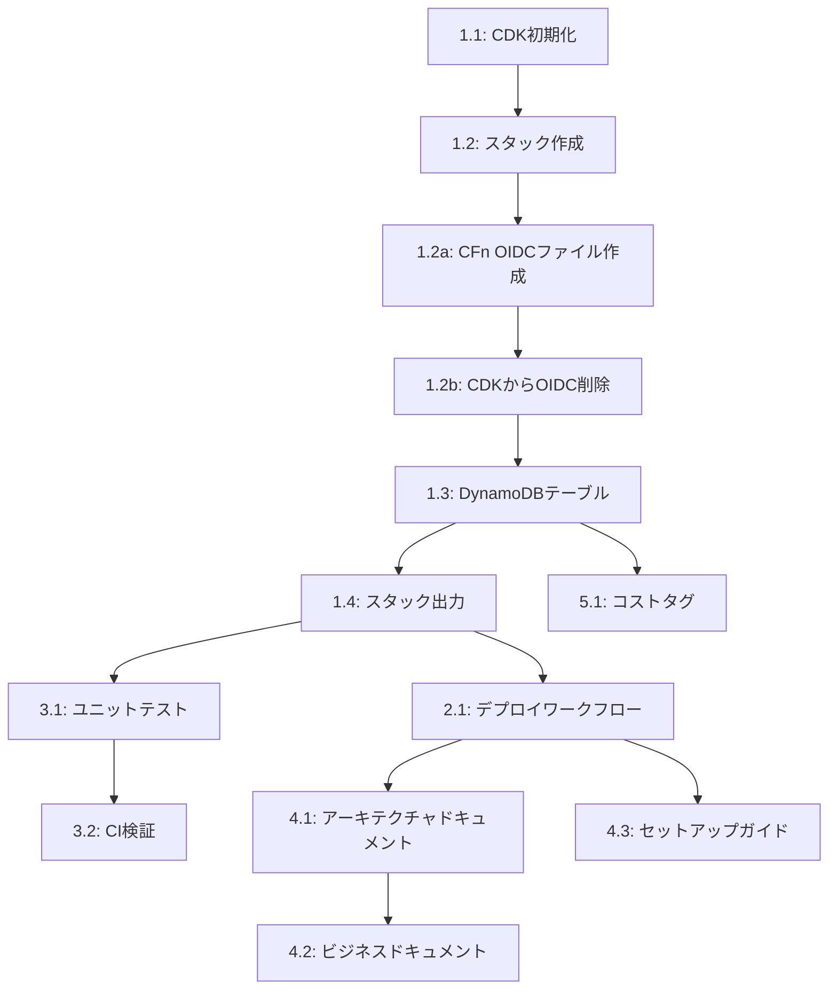

# 実装タスク: DynamoDB Clock Table CI/CD デプロイ

**仕様書**: [spec.md](./spec.md)  
**実装計画**: [plan.md](./plan.md)  
**ステータス**: 実装準備完了  
**作成日**: 2025-12-25

## タスク内訳

### フェーズ1: プロジェクトセットアップ & CDK基盤 (P1)

#### タスク 1.1: CDK プロジェクト構造の初期化
**優先度**: P1  
**見積工数**: 1時間  
**依存関係**: なし

**実施内容**:
- [ ] `infrastructure/` ディレクトリを作成
- [ ] `cdk init app --language typescript` でCDK TypeScriptプロジェクトを初期化
- [ ] `package.json` にNode.js 22のエンジン要件を追加
- [ ] 依存関係をインストール: `aws-cdk-lib@^2.x`, `constructs@^10.x`, `@types/node@22.x`
- [ ] `cdk.json` に環境コンテキスト変数を設定
- [ ] CDK成果物用の `.gitignore` を作成 (`cdk.out/`, `node_modules/`)

**受入条件**:
- CDKプロジェクトがエラーなく初期化される
- `package.json` がNode.js 22を指定している
- `cdk synth` が正常に実行される（空のスタック）

---

#### タスク 1.2: 環境非依存のCDKスタックを作成
**優先度**: P1  
**見積工数**: 2時間  
**依存関係**: タスク 1.1

**実施内容**:
- [ ] 環境パラメータ対応の `lib/spec-kit-stack.ts` を作成
- [ ] コンテキストパラメータの読み取りを実装: `environment = app.node.tryGetContext('environment')`
- [ ] 環境の検証を追加（'dev' または 'staging' のみ許可）
- [ ] 動的なスタック名を生成: `AttendanceKit-${environment}-Stack`
- [ ] スタックprops（環境、リージョン、説明）を設定

**受入条件**:
- スタックが `--context environment=dev` パラメータを受け付ける
- 環境に応じてスタック名が変更される
- 無効な環境でグレースフルに失敗する
- `cdk synth --context environment=dev` が成功する

---

#### タスク 1.2a: CloudFormation OIDC設定ファイルの作成
**優先度**: P1  
**見積工数**: 2時間  
**依存関係**: タスク 1.2

**実施内容**:
- [ ] `infrastructure/cloudformation/` ディレクトリを作成
- [ ] `oidc-provider.yaml` テンプレートを作成
- [ ] IAM OIDCプロバイダーの定義を追加
- [ ] GitHub Actions用のIAMロールを定義（OIDC経由の信頼関係）
- [ ] 必要なIAMポリシーをロールにアタッチ（PowerUserAccess + IAM権限）
- [ ] パラメータ設定（GitHubOrg、GitHubRepo、Environment）
- [ ] CloudFormation出力を定義（RoleARN、OIDCProviderARN、GitHubSecretValue）
- [ ] READMEにリポジトリ同期設定手順を追加

**受入条件**:
- CloudFormationテンプレートが有効なYAMLフォーマットである
- パラメータが適切に設定されている
- 出力が定義されている
- リポジトリ同期設定手順が文書化されている

---

#### タスク 1.2b: CDKスタックからOIDC/IAMロール作成を削除
**優先度**: P1  
**見積工数**: 30分  
**依存関係**: タスク 1.2a

**実施内容**:
- [ ] CDKスタックから`OpenIdConnectProvider`の作成を削除
- [ ] CDKスタックから`IAMRole`の作成を削除
- [ ] CloudFormation出力から`GitHubActionsRoleArn`と`OIDCProviderArn`を削除
- [ ] コメントを追加してOIDCがCloudFormationで管理されることを説明

**受入条件**:
- CDKスタックにOIDC/IAMロール関連のコードが含まれない
- `cdk synth`がエラーなく実行される
- 出力にOIDC関連の項目が含まれない

---

#### タスク 1.3: DynamoDB Clock Tableの実装
**優先度**: P1  
**見積工数**: 2時間  
**依存関係**: タスク 1.2

**実施内容**:
- [ ] スタックにDynamoDB Tableコンストラクトを追加
- [ ] テーブル名を設定: `attendance-kit-${environment}-clock`
- [ ] パーティションキーを設定: `userId` (String)
- [ ] ソートキーを設定: `timestamp` (String, ISO 8601形式)
- [ ] 課金モードを設定: `PAY_PER_REQUEST`
- [ ] ポイントインタイムリカバリを有効化
- [ ] 削除ポリシーを設定: `RETAIN`
- [ ] サーバーサイド暗号化を追加（AWS管理）
- [ ] Global Secondary Index (GSI) を作成:
  - 名前: `DateIndex`
  - パーティションキー: `date` (String, ISO 8601形式)
  - ソートキー: `timestamp` (String, ISO 8601形式)
  - プロジェクション: `ALL`

**受入条件**:
- 正しいパーティションキーとソートキーでテーブルが作成される
- GSIが正しく設定される
- ポイントインタイムリカバリが有効化される
- 削除ポリシーがRETAINに設定される
- `cdk synth` でCloudFormationテンプレートにテーブルリソースが表示される

---

#### タスク 1.4: CloudFormation スタック出力を追加
**優先度**: P1  
**見積工数**: 30分  
**依存関係**: タスク 1.3

**実施内容**:
- [ ] テーブル名のCfnOutputを追加
- [ ] テーブルARNのCfnOutputを追加
- [ ] GSI名のCfnOutputを追加
- [ ] 環境のCfnOutputを追加
- [ ] 環境プレフィックス付きのエクスポート名を設定

**受入条件**:
- すべての出力がCloudFormationスタックで表示される
- エクスポート名に環境が含まれる
- `cdk synth` で出力セクションが表示される

---

### フェーズ2: GitHub Actions CI/CD ワークフロー (P1)

#### タスク 2.1: CDK デプロイワークフローを作成
**優先度**: P1  
**見積工数**: 3時間  
**依存関係**: タスク 1.4

**実施内容**:
- [ ] `.github/workflows/deploy-dev-to-aws.yml` を作成
- [ ] ワークフロートリガーを設定: `main` ブランチへのpush、パスフィルタ: `infrastructure/**`
- [ ] 環境入力付きの手動ワークフローディスパッチを追加（デフォルト: 'dev'）
- [ ] Node.js 22環境をセットアップ
- [ ] OIDCでAWS認証情報を設定
- [ ] CDK依存関係をインストール: `npm ci`
- [ ] CDK bootstrapを実行: `cdk bootstrap --context environment=$ENVIRONMENT`
- [ ] CDK deployを実行: `cdk deploy --context environment=$ENVIRONMENT --require-approval never`
- [ ] スタック出力をキャプチャして表示するステップを追加

**受入条件**:
- ワークフローファイルがGitHub Actionsスキーマで検証される
- 手動ディスパッチで環境選択が可能
- OIDC認証が正しく設定される
- デプロイ前にbootstrapが実行される
- 手動承認なしでデプロイが実行される

---

### フェーズ3: テスト & 検証 (P1)

#### タスク 3.1: CDK ユニットテストを作成
**優先度**: P1  
**見積工数**: 2時間  
**依存関係**: タスク 1.4

**実施内容**:
- [ ] テスト依存関係をインストール: `jest`, `@types/jest`, `ts-jest`
- [ ] `package.json` でJestを設定
- [ ] `test/attendance-kit-stack.test.ts` を作成
- [ ] テスト: スタックがDynamoDBテーブルを作成する
- [ ] テスト: テーブルが正しいパーティションキーとソートキーを持つ
- [ ] テスト: GSIが正しく設定される
- [ ] テスト: ポイントインタイムリカバリが有効化される
- [ ] テスト: 削除ポリシーがRETAINである
- [ ] テスト: テーブル名に環境が含まれる
- [ ] **削除**: OIDC/IAMロール関連のテストを削除
- [ ] `package.json` にテストスクリプトを追加: `npm test`

**受入条件**:
- すべてのテストがパスする
- テストカバレッジが80%以上
- テストがCIワークフローで実行される
- OIDC/IAMロール関連のテストが含まれない

---

#### タスク 3.2: CIにCDK Synth検証を追加
**優先度**: P1  
**見積工数**: 1時間  
**依存関係**: タスク 3.1

**実施内容**:
- [ ] デプロイワークフローを更新してデプロイ前に `npm test` を実行
- [ ] devとstagingの両方で `cdk synth` 検証ステップを追加
- [ ] CloudFormationテンプレートのリンティング（cfn-lint）を追加
- [ ] synthがエラーを出力した場合はワークフローを失敗させる

**受入条件**:
- pushで自動的にテストが実行される
- 複数環境でsynthが検証される
- 無効なCloudFormationでワークフローが失敗する

---

### フェーズ4: ドキュメント (P2)

#### タスク 4.1: アーキテクチャドキュメントを作成
**優先度**: P2  
**見積工数**: 2時間  
**依存関係**: タスク 2.1

**実施内容**:
- [ ] `docs/architecture/dynamodb-clock-table.md` を作成
- [ ] MermaidのER図でテーブルスキーマを文書化
- [ ] アクセスパターンとクエリ例を文書化
- [ ] GSIの使用方法と利点を文書化
- [ ] CloudFormationスタック構造を含める
- [ ] デプロイアーキテクチャ図を追加

**受入条件**:
- ドキュメントにすべてのテーブル属性が含まれる
- アクセスパターンが明確に文書化される
- 図がMermaid構文を使用する
- 例にTypeScript/JavaScriptコードが含まれる

---

#### タスク 4.2: ビジネスドキュメントを作成
**優先度**: P2  
**見積工数**: 1時間  
**依存関係**: タスク 4.1

**実施内容**:
- [ ] `docs/business/clock-table-requirements.md` を作成
- [ ] ビジネスユースケースを文書化
- [ ] データ保持ポリシーを定義
- [ ] ユーザーストーリーと受入条件を文書化
- [ ] コスト分析と予測を含める

**受入条件**:
- ビジネス要件が明確に記載される
- ユースケースが例付きで文書化される
- コスト予測が含まれる

---

#### タスク 4.3: セットアップと運用ガイドを作成
**優先度**: P2  
**見積工数**: 2時間  
**依存関係**: タスク 2.1

**実施内容**:
- [ ] `infrastructure/README.md` を更新
- [ ] 前提条件を文書化（AWSアカウント、CloudFormationでのOIDC設定、リポジトリ同期）
- [ ] 初期セットアップ手順を文書化（CloudFormation OIDC作成 → リポジトリ同期設定 → CDKデプロイ）
- [ ] CloudFormation管理によるOIDC設定の説明を追加
- [ ] リポジトリ同期の設定手順を追加
- [ ] デプロイプロセスを文書化
- [ ] よくある問題のトラブルシューティングを文書化
- [ ] ロールバック手順を追加
- [ ] 基本的なモニタリング（無料）を含める

**受入条件**:
- セットアップガイドで新規ユーザーがデプロイ可能
- すべての前提条件が文書化される
- CloudFormation継続管理の理由が明確に記載される
- リポジトリ同期設定手順が詳細に記載される
- トラブルシューティングセクションが一般的なエラーをカバーする
- 例が実際のコマンドを使用する

---

### フェーズ5: 運用の卓越性 (P2)

#### タスク 5.1: コストモニタリングタグを追加
**優先度**: P2  
**見積工数**: 30分  
**依存関係**: タスク 1.3

**実施内容**:
- [ ] DynamoDBテーブルにコスト配分タグを追加
- [ ] タグ: `Environment`, `Project`, `ManagedBy`, `CostCenter`
- [ ] タグ戦略をアーキテクチャドキュメントに文書化

**受入条件**:
- タグがAWS Cost Explorerで表示される
- すべてのリソースにタグが適用される
- タグ戦略が文書化される

**注意**: CloudWatchアラーム（スロットルなど）や有料監視機能は、コスト削減のため初期段階では実装しません。

---

## タスクサマリー

**総タスク数**: 13  
**優先度P1タスク**: 10  
**優先度P2タスク**: 3  

**見積総工数**: 約17時間

### タスク依存関係グラフ

## 実装順序

### スプリント1: コアインフラストラクチャ (P1)
- タスク 1.1 → 1.2 → 1.2a → 1.2b → 1.3 → 1.4 (基盤 + CloudFormation OIDC)
- タスク 2.1 (CI/CD)
- タスク 3.1 → 3.2 (テスト)

### スプリント2: ドキュメント & 運用 (P2)
- タスク 4.1 → 4.2 → 4.3 (ドキュメント)
- タスク 5.1 (コストタグ)

## 成功指標

- [ ] すべてのP1タスクが完了
- [ ] CloudFormation OIDCプロバイダーとIAMロールがデプロイされる
- [ ] リポジトリ同期が設定される
- [ ] CDKスタックがdev環境に正常にデプロイされる
- [ ] すべてのテストがパスする
- [ ] GitHub Actionsワークフローがエラーなく実行される
- [ ] ドキュメントが完成しレビューされる
- [ ] コストタグが適用される
- [ ] CloudWatchアラームなどの有料監視は初期段階で実装されない（コスト削減）

## 注意事項

- Bootstrapはデプロイワークフローに統合（各デプロイ前に実行）
- 単一のCDKスタックファイルがコンテキストパラメータで複数環境に対応
- デプロイに手動承認は不要（完全自動化）
- **OIDC管理の方針変更**: OIDC Providerは同じURLで複数作成できないため、CloudFormationで継続的に管理する。リポジトリ同期を使用して自動更新を実現する
- **コスト削減**: CloudWatchアラーム（スロットルなど）や有料監視機能は初期段階では実装しない
- **基本監視のみ**: CloudWatchの基本メトリクス（無料）のみを使用
