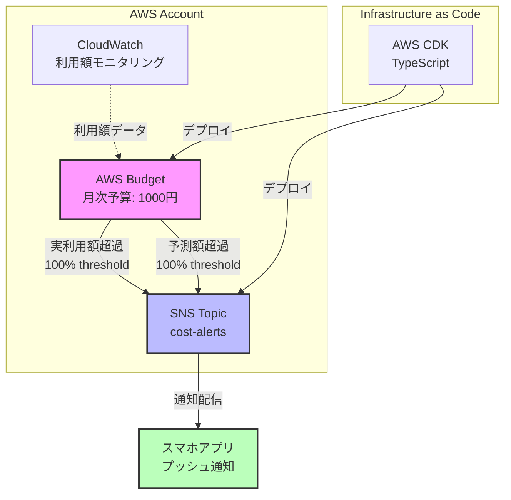
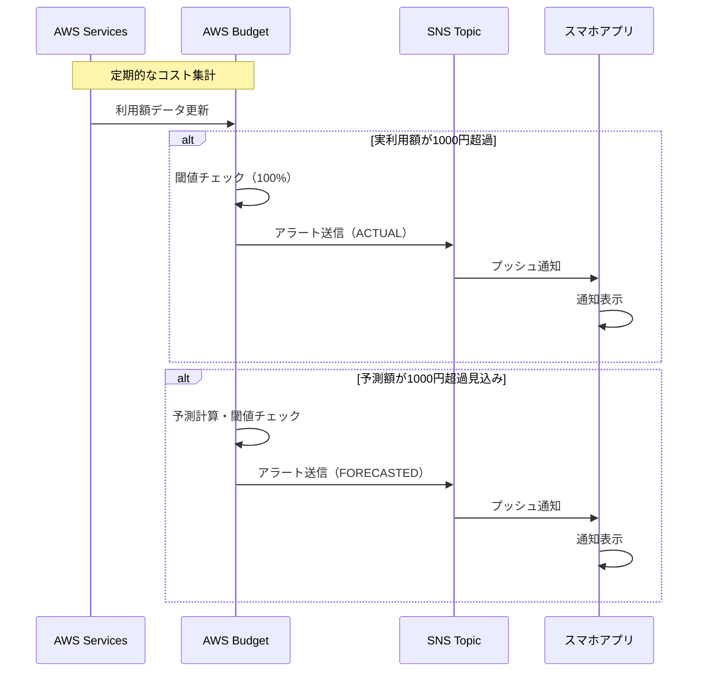
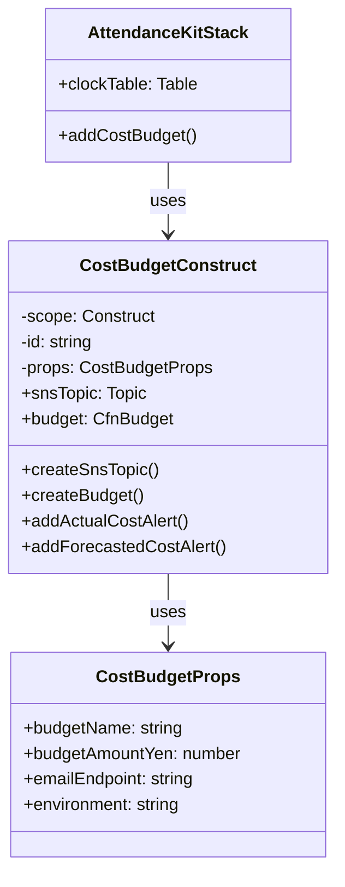

# 実装計画: AWS利用金額アラート

**ブランチ**: `copilot/create-usage-alert-feature` | **日付**: 2025-12-31 | **仕様**: [spec.md](./spec.md)
**入力**: 機能仕様 `/specs/2-aws-cost-usage-alerts/spec.md`

<!--
  🌏 言語ポリシー:
  - 技術的な詳細は英語で記述してください（コード、技術用語など）
  - 説明や理由付けは日本語でも構いません
  - アーキテクチャ図やコメントはバイリンガルが望ましい
-->

## 概要

AWS Budgetを使用して月次1000円の予算を設定し、実利用額および予測額が予算を超えた場合にSNS経由でスマホアプリに通知する機能を実装する。既存のCDKインフラストラクチャに統合し、環境ごとに独立した予算管理を実現する。

## 技術コンテキスト

**言語/バージョン**: TypeScript 5.x, AWS CDK 2.x  
**主要な依存関係**: AWS CDK (aws-cdk-lib), AWS Budgets, AWS SNS  
**ストレージ**: N/A (AWSマネージドサービスを使用)  
**テスト**: CDK assertions (aws-cdk-lib/assertions)  
**ターゲットプラットフォーム**: AWS (ap-northeast-1)
**プロジェクトタイプ**: Infrastructure as Code (single CDK project)  
**パフォーマンス目標**: アラート通知5分以内の配信  
**制約**: 無料枠内での運用、CloudWatchアラームを使用しない  
**規模/スコープ**: 単一AWSアカウント、2環境（dev, staging）

## Constitution Check

*ゲート: Phase 0 research 前に合格必須。Phase 1 design 後に再チェック。*

✅ **仕様駆動開発**: spec.mdから開始  
✅ **段階的な実装**: ユーザーストーリーごとに独立して実装可能  
✅ **ドキュメントファースト**: 本ドキュメントとspec.mdを先に作成  
✅ **テスト可能性**: CDKテストとAWSコンソールでの手動確認が可能  
✅ **シンプルさの追求**: AWS Budgetの標準機能のみを使用、追加の複雑性なし  
✅ **Mermaid図表**: アーキテクチャ図をMermaidで作成

## Project Structure

### ドキュメント（この機能）

```text
specs/2-aws-cost-usage-alerts/
├── spec.md              # 機能仕様書
├── plan.md              # このファイル（実装計画）
└── tasks.md             # 実装タスク
```

### ソースコード (リポジトリルート)

既存のCDKプロジェクトに統合:

```text
infrastructure/deploy/
├── lib/
│   ├── attendance-kit-stack.ts      # 既存: DynamoDB等
│   └── constructs/
│       └── cost-budget.ts           # 新規: 予算アラート用Construct
├── test/
│   └── cost-budget.test.ts          # 新規: 予算アラートのテスト
├── bin/
│   └── app.ts                       # 既存: エントリーポイント
└── package.json                     # 依存関係管理
```

**構造の決定**: 既存のCDKプロジェクト構造を維持し、新しいConstructとして予算アラート機能を追加する。これにより、既存のインフラストラクチャとの統合が容易になり、デプロイプロセスも統一できる。

## アーキテクチャ設計

### システム構成図



### データフロー



### CDK Construct設計



## 技術的アプローチ

### AWS Budgetの実装方針

- **リソースタイプ**: `AWS::Budgets::Budget` (L1 Construct: CfnBudget)
- **理由**: AWS CDKでBudgetのL2 Constructは存在しないため、CfnBudgetを使用
- **予算タイプ**: COST (コストベース)
- **時間単位**: MONTHLY (月次)
- **通貨**: JPY (日本円)

### SNS Topicの実装方針

- **リソースタイプ**: `aws-cdk-lib/aws-sns` (L2 Construct: Topic)
- **サブスクリプション戦略**:
  - **初期実装（MVP）**: Emailサブスクリプション
    - 理由: 検証が容易、追加コストなし、即座に動作確認可能
    - スマホでメール受信することで実質的にモバイル通知を実現
  - **将来拡張**: Mobile Push（AWS SNS Mobile Push）
    - モバイルアプリのエンドポイントが確定次第対応
  - オプション: Email, SMS, Application endpoint (Mobile Push)
- **アクセスポリシー**: AWS Budgetサービスからのパブリッシュを許可

### 環境ごとの設定

```typescript
interface EnvironmentConfig {
  dev: {
    budgetName: "attendance-kit-dev-monthly-budget";
    budgetAmountYen: 1000;
    alertEmail: "dev-alerts@example.com"; // 要明確化
  },
  staging: {
    budgetName: "attendance-kit-staging-monthly-budget";
    budgetAmountYen: 1000;
    alertEmail: "staging-alerts@example.com"; // 要明確化
  }
}
```

### アラート設定

実利用額アラート:
- Type: ACTUAL
- Threshold: 100% (1000円)
- Comparison: GREATER_THAN

予測額アラート:
- Type: FORECASTED
- Threshold: 100% (1000円)
- Comparison: GREATER_THAN

## 実装詳細

### Phase 1: SNS Topic作成

```typescript
// infrastructure/deploy/lib/constructs/cost-budget.ts

import * as sns from 'aws-cdk-lib/aws-sns';
import * as subscriptions from 'aws-cdk-lib/aws-sns-subscriptions';

export class CostBudgetConstruct extends Construct {
  public readonly snsTopic: sns.Topic;
  
  private createSnsTopic(props: CostBudgetProps): sns.Topic {
    const topic = new sns.Topic(this, 'CostAlertTopic', {
      topicName: `${props.environment}-cost-alerts`,
      displayName: 'AWS Cost Budget Alerts',
    });
    
    // Emailサブスクリプション（初期実装）
    if (props.emailEndpoint) {
      topic.addSubscription(
        new subscriptions.EmailSubscription(props.emailEndpoint)
      );
    }
    
    return topic;
  }
}
```

### Phase 2: Budget作成

```typescript
import * as budgets from 'aws-cdk-lib/aws-budgets';

private createBudget(props: CostBudgetProps): budgets.CfnBudget {
  return new budgets.CfnBudget(this, 'MonthlyBudget', {
    budget: {
      budgetName: props.budgetName,
      budgetType: 'COST',
      timeUnit: 'MONTHLY',
      budgetLimit: {
        amount: props.budgetAmountYen,
        unit: 'JPY',
      },
    },
    notificationsWithSubscribers: [
      // 実利用額アラート
      {
        notification: {
          notificationType: 'ACTUAL',
          comparisonOperator: 'GREATER_THAN',
          threshold: 100,
          thresholdType: 'PERCENTAGE',
        },
        subscribers: [
          {
            subscriptionType: 'SNS',
            address: this.snsTopic.topicArn,
          },
        ],
      },
      // 予測額アラート
      {
        notification: {
          notificationType: 'FORECASTED',
          comparisonOperator: 'GREATER_THAN',
          threshold: 100,
          thresholdType: 'PERCENTAGE',
        },
        subscribers: [
          {
            subscriptionType: 'SNS',
            address: this.snsTopic.topicArn,
          },
        ],
      },
    ],
  });
}
```

### Phase 3: SNS Topic Policy

AWS Budgetサービスからの送信を許可:

```typescript
import * as iam from 'aws-cdk-lib/aws-iam';

private grantBudgetPublishPermission(): void {
  this.snsTopic.grantPublish({
    grantPrincipal: new iam.ServicePrincipal('budgets.amazonaws.com'),
  });
}
```

## テスト戦略

### CDK Unit Tests

```typescript
// infrastructure/deploy/test/cost-budget.test.ts

import { Template } from 'aws-cdk-lib/assertions';
import { Stack } from 'aws-cdk-lib';
import { CostBudgetConstruct } from '../lib/constructs/cost-budget';

test('SNS Topic Created', () => {
  const stack = new Stack();
  new CostBudgetConstruct(stack, 'TestBudget', {
    budgetName: 'test-budget',
    budgetAmountYen: 1000,
    emailEndpoint: 'test@example.com',
    environment: 'test',
  });
  
  const template = Template.fromStack(stack);
  template.resourceCountIs('AWS::SNS::Topic', 1);
});

test('Budget with Actual and Forecasted Alerts', () => {
  const stack = new Stack();
  new CostBudgetConstruct(stack, 'TestBudget', {
    budgetName: 'test-budget',
    budgetAmountYen: 1000,
    emailEndpoint: 'test@example.com',
    environment: 'test',
  });
  
  const template = Template.fromStack(stack);
  template.hasResourceProperties('AWS::Budgets::Budget', {
    Budget: {
      BudgetType: 'COST',
      TimeUnit: 'MONTHLY',
      BudgetLimit: {
        Amount: 1000,
        Unit: 'JPY',
      },
    },
  });
});
```

### 手動統合テスト

1. CDKをデプロイ
2. AWSコンソールでBudget設定を確認
3. SNS Topic登録のメール確認リンクをクリック
4. テスト通知を送信して受信確認

## デプロイ手順

### 既存ワークフローへの統合

`.github/workflows/deploy-to-aws.yml` は変更不要。既存のデプロイプロセスで自動的にデプロイされる。

### 環境変数の追加

GitHub Secretsに追加が必要:
- `COST_ALERT_EMAIL_DEV`: dev環境のアラート送信先メールアドレス
  - 値の取得方法: プロジェクトオーナーに確認、またはチーム共有のメーリングリストを使用
- `COST_ALERT_EMAIL_STAGING`: staging環境のアラート送信先メールアドレス
  - 値の取得方法: プロジェクトオーナーに確認、またはチーム共有のメーリングリストを使用

**実装時の注意**: 
- CDKコードではプロセス環境変数またはCDK Contextから読み込み
- 未設定の場合はデプロイ時にエラーとなるように実装（必須パラメータ）

### 初回デプロイ後の作業

1. SNSサブスクリプション確認メールを受信
2. メール内の確認リンクをクリック
3. AWSコンソールでBudget設定を確認

## セキュリティ考慮事項

### IAM権限

- AWS BudgetサービスがSNS Topicに送信する権限のみを付与
- 最小権限の原則に従い、他のサービスからのアクセスは拒否

### データ保護

- SNS通知には機密情報を含めない（アカウントIDは含まれるが、アクセスキー等は含まれない）
- メール配信の場合、TLS暗号化が自動的に使用される

## コスト分析

### AWS Budget自体のコスト

- 最初の2つのBudget: 無料
- 3つ目以降: $0.02/日/Budget

本実装では2環境（dev, staging）でそれぞれ1つのBudgetを作成するため、**完全に無料枠内**で運用可能。

### SNS通知コスト

- Email通知: 最初の1,000件/月 無料
- 予想通知頻度: 月2-4件程度（予算超過時のみ）

**結論**: 追加コストはほぼゼロ。

## 未明確化事項

### 要確認項目

1. **アラート送信先のメールアドレス** ✅ 対応済み
   - GitHub Secretsで管理
   - dev環境とstaging環境で設定必要

2. **予算額の環境ごとの差異**
   - dev: 1000円
   - staging: 1000円（現状は同額、必要に応じて調整可能）

3. **将来のモバイル対応** 📋 将来対応
   - 初期実装: Email（スマホでメール受信）
   - 将来拡張: AWS SNS Mobile Push
   - モバイルアプリのエンドポイント確定後に対応

4. **通知内容のカスタマイズ**
   - デフォルトのAWS Budget通知メッセージを使用
   - 標準メッセージで十分な情報が含まれる（利用額、予算額、アカウント情報）

## 関連ドキュメント

### 開発ガイドライン
- [Agent開発ガイドライン](../../.github/agents/AGENTS.md) - Spec-Kitワークフロー、言語ポリシー、コミット規約

### プロジェクト文書
- [機能仕様](./spec.md) - ユーザーストーリーと要件定義
- [実装タスク](./tasks.md) - タスク分解と依存関係
- [プロジェクト憲法](../../memory/constitution.md) - プロジェクトの原則
