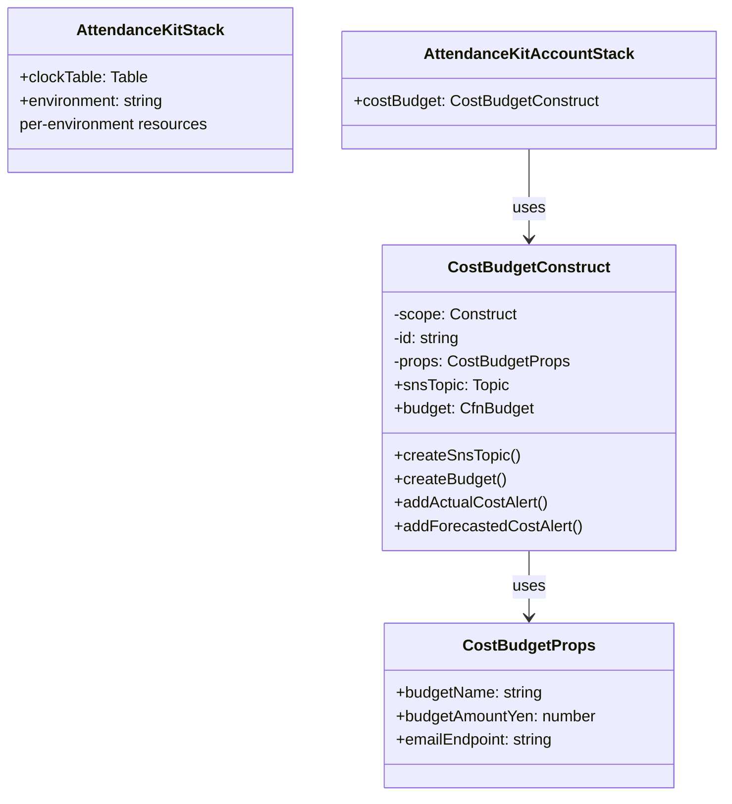

# 実装計画: AWS利用金額アラート

**ブランチ**: `copilot/create-usage-alert-feature` | **日付**: 2025-12-31 | **仕様**: [spec.md](./spec.md)
**入力**: 機能仕様 `/specs/2-aws-cost-usage-alerts/spec.md`

<!--
  🌏 言語ポリシー:
  - 技術的な詳細は英語で記述してください（コード、技術用語など）
  - 説明や理由付けは日本語でも構いません
  - アーキテクチャ図やコメントはバイリンガルが望ましい
-->

## 概要

AWS Budgetを使用してAWSアカウント全体の月次1000円の予算を設定し、実利用額および予測額が予算を超えた場合にSNS経由でスマホアプリに通知する機能を実装する。既存のCDKインフラストラクチャに統合し、アカウント単位での予算管理を実現する。

## 技術コンテキスト

**言語/バージョン**: TypeScript 5.x, AWS CDK 2.x  
**主要な依存関係**: AWS CDK (aws-cdk-lib), AWS Budgets, AWS SNS  
**ストレージ**: N/A (AWSマネージドサービスを使用)  
**テスト**: CDK assertions (aws-cdk-lib/assertions)  
**ターゲットプラットフォーム**: AWS (ap-northeast-1)
**プロジェクトタイプ**: Infrastructure as Code (single CDK project)  
**パフォーマンス目標**: アラート通知5分以内の配信  
**制約**: 無料枠内での運用、CloudWatchアラームを使用しない  
**規模/スコープ**: 単一AWSアカウント、アカウント全体のコスト監視（環境別ではない）

## Constitution Check

*ゲート: Phase 0 research 前に合格必須。Phase 1 design 後に再チェック。*

✅ **仕様駆動開発**: spec.mdから開始  
✅ **段階的な実装**: ユーザーストーリーごとに独立して実装可能  
✅ **ドキュメントファースト**: 本ドキュメントとspec.mdを先に作成  
✅ **テスト可能性**: CDKテストとAWSコンソールでの手動確認が可能  
✅ **シンプルさの追求**: AWS Budgetの標準機能のみを使用、追加の複雑性なし  
✅ **Mermaid図表**: アーキテクチャ図をMermaidで作成

## Project Structure

### ドキュメント（この機能）

```text
specs/2-aws-cost-usage-alerts/
├── spec.md              # 機能仕様書
├── plan.md              # このファイル（実装計画）
└── tasks.md             # 実装タスク
```

### ソースコード (リポジトリルート)

既存のCDKプロジェクトに統合:

```text
infrastructure/deploy/
├── lib/
│   ├── attendance-kit-stack.ts          # 既存: DynamoDB等（環境単位）
│   ├── attendance-kit-account-stack.ts  # 新規: アカウント単位リソース用Stack
│   └── constructs/
│       └── cost-budget.ts               # 新規: 予算アラート用Construct
├── test/
│   ├── cost-budget.test.ts                      # 新規: 予算アラートのテスト
│   └── attendance-kit-account-stack.test.ts     # 新規: AccountStackのテスト
├── bin/
│   └── app.ts                           # 既存: エントリーポイント（要リファクタリング）
└── package.json                         # 依存関係管理
```

**構造の決定**: 既存のCDKプロジェクト構造を維持し、新しいConstructとして予算アラート機能を追加する。これにより、既存のインフラストラクチャとの統合が容易になり、デプロイプロセスも統一できる。

**重要な変更点**: 予算はアカウント単位で1つ作成するため、環境（dev/staging）に依存しない形でConstructを設計する。既存のapp.tsとスタック設計をリファクタリングし、アカウントレベルのリソースと環境レベルのリソースを分離する。

**命名規則**: 既存の `AttendanceKitStack` に合わせて、`AttendanceKitAccountStack` という命名を使用。ファイル名も `attendance-kit-account-stack.ts` として統一性を保つ。

## アーキテクチャ設計

### システム構成図


### データフロー


### CDK Construct設計



## 技術的アプローチ

### AWS Budgetの実装方針

- **リソースタイプ**: `AWS::Budgets::Budget` (L1 Construct: CfnBudget)
- **理由**: AWS CDKでBudgetのL2 Constructは存在しないため、CfnBudgetを使用
- **予算タイプ**: COST (コストベース)
- **時間単位**: MONTHLY (月次)
- **通貨**: JPY (日本円)

### SNS Topicの実装方針

- **リソースタイプ**: `aws-cdk-lib/aws-sns` (L2 Construct: Topic)
- **サブスクリプション戦略**:
  - **初期実装（MVP）**: Emailサブスクリプション
    - 理由: 検証が容易、追加コストなし、即座に動作確認可能
    - スマホでメール受信することで実質的にモバイル通知を実現
  - **将来拡張**: Mobile Push（AWS SNS Mobile Push）
    - モバイルアプリのエンドポイントが確定次第対応
  - オプション: Email, SMS, Application endpoint (Mobile Push)
- **アクセスポリシー**: AWS Budgetサービスからのパブリッシュを許可

### 環境ごとの設定

**重要な変更**: 予算はアカウント単位で設定するため、環境別の設定は不要。代わりにアカウント全体の設定を1つ定義する。

```typescript
interface AccountConfig {
  budgetName: "attendance-kit-account-monthly-budget";
  budgetAmountYen: 1000;
  alertEmail: "cost-alerts@example.com"; // 要明確化
}
```

**リファクタリングポイント**: 既存のapp.tsは環境単位でスタックを作成しているが、アカウントレベルのリソース（予算アラート）と環境レベルのリソース（DynamoDBテーブル）を分離する必要がある。新しい `AttendanceKitAccountStack` を作成し、予算アラートはそこに配置する。命名規則は既存の `AttendanceKitStack` に合わせる。

### アラート設定

実利用額アラート:
- Type: ACTUAL
- Threshold: 100% (1000円)
- Comparison: GREATER_THAN

予測額アラート:
- Type: FORECASTED
- Threshold: 100% (1000円)
- Comparison: GREATER_THAN

## 実装詳細

### Phase 1: SNS Topic作成

```typescript
// infrastructure/deploy/lib/constructs/cost-budget.ts

import * as sns from 'aws-cdk-lib/aws-sns';
import * as subscriptions from 'aws-cdk-lib/aws-sns-subscriptions';

export class CostBudgetConstruct extends Construct {
  public readonly snsTopic: sns.Topic;
  
  private createSnsTopic(props: CostBudgetProps): sns.Topic {
    const topic = new sns.Topic(this, 'CostAlertTopic', {
      topicName: 'attendance-kit-cost-alerts',
      displayName: 'AWS Cost Budget Alerts',
    });
    
    // Emailサブスクリプション（初期実装）
    if (props.emailEndpoint) {
      topic.addSubscription(
        new subscriptions.EmailSubscription(props.emailEndpoint)
      );
    }
    
    return topic;
  }
}
```

### Phase 2: Budget作成

```typescript
import * as budgets from 'aws-cdk-lib/aws-budgets';

private createBudget(props: CostBudgetProps): budgets.CfnBudget {
  return new budgets.CfnBudget(this, 'MonthlyBudget', {
    budget: {
      budgetName: props.budgetName,
      budgetType: 'COST',
      timeUnit: 'MONTHLY',
      budgetLimit: {
        amount: props.budgetAmountYen,
        unit: 'JPY',
      },
    },
    notificationsWithSubscribers: [
      // 実利用額アラート
      {
        notification: {
          notificationType: 'ACTUAL',
          comparisonOperator: 'GREATER_THAN',
          threshold: 100,
          thresholdType: 'PERCENTAGE',
        },
        subscribers: [
          {
            subscriptionType: 'SNS',
            address: this.snsTopic.topicArn,
          },
        ],
      },
      // 予測額アラート
      {
        notification: {
          notificationType: 'FORECASTED',
          comparisonOperator: 'GREATER_THAN',
          threshold: 100,
          thresholdType: 'PERCENTAGE',
        },
        subscribers: [
          {
            subscriptionType: 'SNS',
            address: this.snsTopic.topicArn,
          },
        ],
      },
    ],
  });
}
```

### Phase 3: SNS Topic Policy

AWS Budgetサービスからの送信を許可:

```typescript
import * as iam from 'aws-cdk-lib/aws-iam';

private grantBudgetPublishPermission(): void {
  this.snsTopic.grantPublish({
    grantPrincipal: new iam.ServicePrincipal('budgets.amazonaws.com'),
  });
}
```

## テスト戦略

### CDK Unit Tests

```typescript
// infrastructure/deploy/test/cost-budget.test.ts

import { Template } from 'aws-cdk-lib/assertions';
import { Stack } from 'aws-cdk-lib';
import { CostBudgetConstruct } from '../lib/constructs/cost-budget';

test('SNS Topic Created', () => {
  const stack = new Stack();
  new CostBudgetConstruct(stack, 'TestBudget', {
    budgetName: 'test-budget',
    budgetAmountYen: 1000,
    emailEndpoint: 'test@example.com',
  });
  
  const template = Template.fromStack(stack);
  template.resourceCountIs('AWS::SNS::Topic', 1);
});

test('Budget with Actual and Forecasted Alerts', () => {
  const stack = new Stack();
  new CostBudgetConstruct(stack, 'TestBudget', {
    budgetName: 'test-budget',
    budgetAmountYen: 1000,
    emailEndpoint: 'test@example.com',
  });
  
  const template = Template.fromStack(stack);
  template.hasResourceProperties('AWS::Budgets::Budget', {
    Budget: {
      BudgetType: 'COST',
      TimeUnit: 'MONTHLY',
      BudgetLimit: {
        Amount: 1000,
        Unit: 'JPY',
      },
    },
  });
});
```

### 手動統合テスト

1. CDKをデプロイ
2. AWSコンソールでBudget設定を確認
3. SNS Topic登録のメール確認リンクをクリック
4. テスト通知を送信して受信確認

## デプロイ手順

### GitHub Actions による自動デプロイ

#### 環境スタック（Environment-Level）

環境レベルリソース（DynamoDBテーブル等）のデプロイ:

**ワークフロー**: `.github/workflows/deploy-environment-stack.yml`

**トリガー**:
- `infrastructure/deploy/lib/attendance-kit-stack.ts` の変更
- `infrastructure/deploy/test/attendance-kit-stack.test.ts` の変更
- `infrastructure/deploy/bin/app.ts` の変更
- `infrastructure/deploy/package*.json` の変更
- 手動実行（workflow_dispatch）

**デプロイ先**: `AttendanceKit-Dev-Stack` または `AttendanceKit-Staging-Stack`

#### アカウントスタック（Account-Level）

アカウントレベルリソース（AWS Budget, SNS）のデプロイ:

**ワークフロー**: `.github/workflows/deploy-account-stack.yml`

**トリガー**:
- `infrastructure/deploy/lib/attendance-kit-account-stack.ts` の変更
- `infrastructure/deploy/lib/constructs/cost-budget.ts` の変更
- `infrastructure/deploy/test/attendance-kit-account-stack.test.ts` の変更
- `infrastructure/deploy/test/cost-budget.test.ts` の変更
- 手動実行（workflow_dispatch）

**デプロイ先**: `AttendanceKit-Account-Stack`

**必須環境変数**: `COST_ALERT_EMAIL`（GitHub Secrets）

### 環境変数の設定

GitHub Secretsに追加が必要:
- `COST_ALERT_EMAIL`: アカウント全体のアラート送信先メールアドレス
  - 値の取得方法: プロジェクトオーナーに確認、またはチーム共有のメーリングリストを使用
  - **重要**: この環境変数が未設定の場合、アカウントスタックのデプロイが失敗します

**実装時の注意**: 
- CDKコードではプロセス環境変数から読み込み（`process.env.COST_ALERT_EMAIL`）
- 未設定の場合はデプロイ時にエラーとなるように実装（必須パラメータ）

**リファクタリング事項**:
- 既存のapp.tsを更新し、アカウントレベルのスタック（`AttendanceKitAccountStack`）を作成
- 環境レベルのスタック（`AttendanceKitStack`）とは分離して管理
- 命名規則: 既存スタックに合わせて `AttendanceKitAccountStack` クラスと `attendance-kit-account-stack.ts` ファイル名を使用
- 各スタックは独立したワークフローでデプロイされる

### 初回デプロイ後の作業

1. SNSサブスクリプション確認メールを受信
2. メール内の確認リンクをクリック
3. AWSコンソールでBudget設定を確認

## セキュリティ考慮事項

### IAM権限

- AWS BudgetサービスがSNS Topicに送信する権限のみを付与
- 最小権限の原則に従い、他のサービスからのアクセスは拒否

### データ保護

- SNS通知には機密情報を含めない（アカウントIDは含まれるが、アクセスキー等は含まれない）
- メール配信の場合、TLS暗号化が自動的に使用される

## コスト分析

### AWS Budget自体のコスト

- 最初の2つのBudget: 無料
- 3つ目以降: $0.02/日/Budget

本実装ではアカウント単位で1つのBudgetのみを作成するため、**完全に無料枠内**で運用可能。

### SNS通知コスト

- Email通知: 最初の1,000件/月 無料
- 予想通知頻度: 月2-4件程度（予算超過時のみ）

**結論**: 追加コストはほぼゼロ。

## 未明確化事項

### 要確認項目

1. **アラート送信先のメールアドレス** ✅ 対応済み
   - GitHub Secretsで管理
   - アカウント全体で1つのメールアドレスを設定

2. **予算額**
   - アカウント全体: 1000円/月

3. **将来のモバイル対応** 📋 将来対応
   - 初期実装: Email（スマホでメール受信）
   - 将来拡張: AWS SNS Mobile Push
   - モバイルアプリのエンドポイント確定後に対応

4. **通知内容のカスタマイズ**
   - デフォルトのAWS Budget通知メッセージを使用
   - 標準メッセージで十分な情報が含まれる（利用額、予算額、アカウント情報）

5. **既存コードのリファクタリング** ⚠️ 要実装
   - app.tsでアカウントレベルスタック（`AttendanceKitAccountStack`）を新規作成
   - 環境レベルスタック（`AttendanceKitStack`）とリソースを分離
   - アカウント単位リソース: AWS Budget, SNS Topic
   - 環境単位リソース: DynamoDB Table
   - 命名規則を統一: `attendance-kit-account-stack.ts` ファイル、`AttendanceKitAccountStack` クラス

## 関連ドキュメント

### 開発ガイドライン
- [Agent開発ガイドライン](../../.github/agents/AGENTS.md) - Spec-Kitワークフロー、言語ポリシー、コミット規約

### プロジェクト文書
- [機能仕様](./spec.md) - ユーザーストーリーと要件定義
- [実装タスク](./tasks.md) - タスク分解と依存関係
- [プロジェクト憲法](../../memory/constitution.md) - プロジェクトの原則
