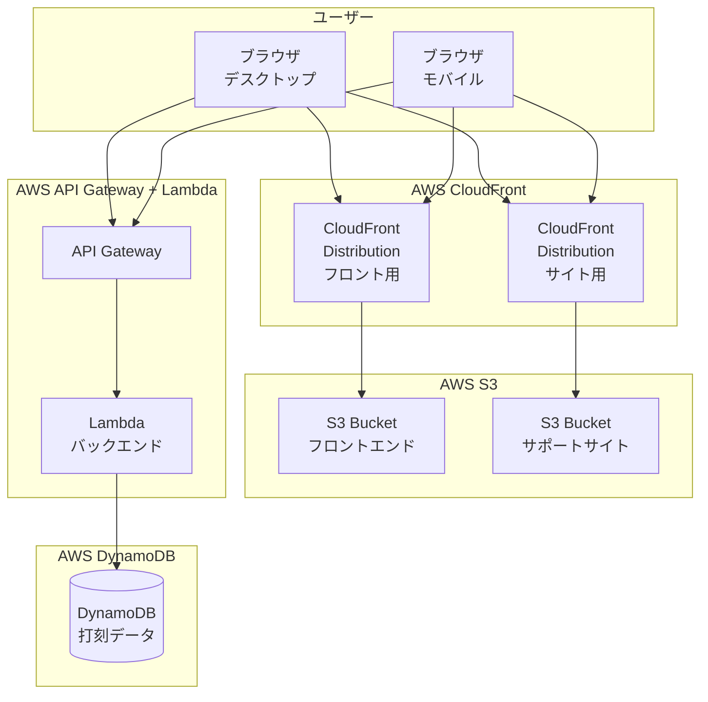

# 技術計画: MVP モノレポ構成

## アーキテクチャ概要

### システム構成図



## モノレポ構成

### パッケージ管理

**npm workspaces** を使用:
- 依存関係の一元管理
- パッケージ間の参照が容易
- ビルドキャッシュの共有

### ディレクトリ構造詳細

```
attendance-kit/
├── package.json                 # ルートpackage.json（workspaces定義）
├── tsconfig.json               # ベースTypeScript設定
├── .gitignore                  # Git除外設定（更新）
├── apps/
│   ├── clock-app-frontend/
│   │   ├── package.json
│   │   ├── tsconfig.json       # 継承設定
│   │   ├── vite.config.ts
│   │   ├── index.html
│   │   ├── src/
│   │   │   ├── main.tsx
│   │   │   ├── App.tsx
│   │   │   ├── components/
│   │   │   │   ├── ClockInButton.tsx
│   │   │   │   └── ClockOutButton.tsx
│   │   │   ├── services/
│   │   │   │   └── api.ts
│   │   │   └── types/
│   │   │       └── index.ts
│   │   └── public/
│   └── clock-app-backend/
│       ├── package.json
│       ├── tsconfig.json
│       ├── nest-cli.json
│       ├── src/
│       │   ├── main.ts
│       │   ├── app.module.ts
│       │   ├── clock/
│       │   │   ├── clock.controller.ts
│       │   │   ├── clock.service.ts
│       │   │   └── clock.module.ts
│       │   └── types/
│       │       └── index.ts
│       └── test/
├── sites/
│   └── product-support/
│       ├── package.json
│       ├── tsconfig.json
│       ├── astro.config.mjs
│       ├── src/
│       │   ├── content/
│       │   │   └── docs/
│       │   │       ├── index.md
│       │   │       ├── getting-started.md
│       │   │       └── faq.md
│       │   └── assets/
│       └── public/
├── packages/
│   ├── config/
│   │   ├── package.json
│   │   ├── tsconfig.json
│   │   ├── vite.config.base.ts
│   │   └── eslint.config.js
│   └── types/
│       ├── package.json
│       ├── tsconfig.json
│       └── src/
│           ├── index.ts
│           ├── clock.ts          # 打刻関連の型定義
│           └── api.ts            # API関連の型定義
└── infrastructure/
    └── deploy/                    # 既存のCDKコード
```

## 技術スタック詳細

### フロントエンド（React）

**依存パッケージ**:
```json
{
  "dependencies": {
    "react": "^18.2.0",
    "react-dom": "^18.2.0"
  },
  "devDependencies": {
    "@types/react": "^18.2.0",
    "@types/react-dom": "^18.2.0",
    "@vitejs/plugin-react": "^4.2.0",
    "typescript": "^5.3.0",
    "vite": "^5.0.0"
  }
}
```

**Vite設定**:
- React Fast Refresh有効化
- プライマリカラー（#007CC0）をCSS変数として定義
- ビルド最適化設定

### バックエンド（NestJS）

**依存パッケージ**:
```json
{
  "dependencies": {
    "@nestjs/common": "^10.0.0",
    "@nestjs/core": "^10.0.0",
    "@nestjs/platform-express": "^10.0.0",
    "@nestjs/swagger": "^7.0.0",
    "reflect-metadata": "^0.1.13",
    "rxjs": "^7.8.0"
  },
  "devDependencies": {
    "@nestjs/cli": "^10.0.0",
    "@types/node": "^20.0.0",
    "typescript": "^5.3.0"
  }
}
```

**Lambda対応**:
- Serverless NestJS adapter使用検討
- 初期段階では開発サーバーのみ実装
- Lambda統合は後続タスクで実装

### サポートサイト（Astro + Starlight）

**依存パッケージ**:
```json
{
  "dependencies": {
    "@astrojs/starlight": "^0.15.0",
    "astro": "^4.0.0",
    "sharp": "^0.32.0"
  },
  "devDependencies": {
    "typescript": "^5.3.0"
  }
}
```

**Starlight設定**:
- サイドバーナビゲーション
- 検索機能
- レスポンシブデザイン
- カスタムカラーテーマ（#007CC0）

### 共通パッケージ

#### packages/config

**目的**: ビルド設定の共通化

**内容**:
- ベースVite設定
- ベースTypeScript設定
- ESLint設定（将来追加）

#### packages/types

**目的**: 型定義の共有

**内容**:
```typescript
// clock.ts
export interface ClockRecord {
  id: string;
  userId: string;
  clockInTime: Date;
  clockOutTime?: Date;
  type: 'clock-in' | 'clock-out';
}

export interface User {
  id: string;
  name: string;
}

// api.ts
export interface ApiResponse<T> {
  success: boolean;
  data?: T;
  error?: string;
}

export interface ClockInRequest {
  userId: string;
}

export interface ClockOutRequest {
  userId: string;
}
```

## ビルド戦略

### 開発時

**コマンド構成**:
```json
{
  "scripts": {
    "dev": "npm run dev --workspaces --if-present",
    "dev:frontend": "npm run dev -w apps/clock-app-frontend",
    "dev:backend": "npm run dev -w apps/clock-app-backend",
    "dev:site": "npm run dev -w sites/product-support"
  }
}
```

**開発サーバー**:
- フロントエンド: http://localhost:5173
- バックエンド: http://localhost:3000
- サポートサイト: http://localhost:4321

### 本番ビルド

**コマンド構成**:
```json
{
  "scripts": {
    "build": "npm run build --workspaces --if-present",
    "build:frontend": "npm run build -w apps/clock-app-frontend",
    "build:backend": "npm run build -w apps/clock-app-backend",
    "build:site": "npm run build -w sites/product-support"
  }
}
```

**ビルド成果物**:
- フロントエンド: `apps/clock-app-frontend/dist`
- バックエンド: `apps/clock-app-backend/dist`
- サポートサイト: `sites/product-support/dist`

## デプロイ戦略

### 初期段階（手動デプロイ）

**フロントエンド・サポートサイト**:
- ビルド成果物をS3にアップロード
- CloudFront経由で配信

**バックエンド**:
- 後続タスクでLambda統合を実装
- 初期段階では開発サーバーのみ

### 将来のCI/CD（スコープ外）

- GitHub Actionsによる自動ビルド
- AWS CDKによるインフラ管理
- 自動デプロイパイプライン

## レスポンシブデザイン戦略

### ブレークポイント

```css
:root {
  --primary-color: #007CC0;
}

/* デスクトップファースト */
@media (max-width: 1279px) {
  /* タブレット対応 */
}

@media (max-width: 768px) {
  /* スマートフォン対応 */
}
```

### レイアウト方針

- デスクトップ: 横並びレイアウト
- タブレット: 2カラム → 1カラム
- スマートフォン: 縦積みレイアウト

## セキュリティ考慮事項

### 初期段階

**認証**: なし（ユーザー入力のみ）

**注意事項**:
- 本番環境では認証必須
- 現段階はMVPのため簡易実装

### 将来の改善（スコープ外）

- OIDCまたはCognitoによる認証
- API Gatewayでの認可
- CORS設定
- レート制限

## パフォーマンス戦略

### フロントエンド

- Viteによる高速ビルド
- Tree shaking有効化
- コード分割（動的import）

### バックエンド

- Lambda Cold Start対策（将来）
- DynamoDB On-Demand課金

### サポートサイト

- 静的サイト生成（SSG）
- 画像最適化（Sharp）

## モニタリング

### 初期段階

- CloudWatch基本メトリクスのみ
- 無料枠範囲での利用

### 将来の拡張（スコープ外）

- カスタムメトリクス
- アラート設定
- ログ集約

## リスクと対策

### リスク

**技術的リスク**:
- Lambdaでのコールドスタート遅延
- workspacesの学習コスト
- 型定義の共有による循環依存

**対策**:
- Lambda Warmup戦略の検討（将来）
- ドキュメント整備
- 型定義の適切な分割

### 緩和策

- 段階的な実装
- 各パッケージの独立性を保つ
- 明確な依存関係の定義

## 実装の優先順位

### Phase 1: 基本構成

- ルートpackage.jsonとworkspaces設定
- 共通パッケージ（config, types）
- フロントエンドの基本構成

### Phase 2: アプリケーション実装

- フロントエンドの打刻機能
- バックエンドのAPI実装
- サポートサイトの基本ページ

### Phase 3: 統合と検証

- パッケージ間の連携確認
- ビルドスクリプトの動作確認
- 開発サーバーの動作確認

## 参考実装

### 型定義の共有例

```typescript
// packages/types/src/clock.ts
export interface ClockRecord {
  id: string;
  userId: string;
  clockInTime: Date;
  clockOutTime?: Date;
}

// apps/clock-app-frontend/src/services/api.ts
import { ClockRecord } from '@attendance-kit/types';

export async function fetchRecords(): Promise<ClockRecord[]> {
  // 実装
}

// apps/clock-app-backend/src/clock/clock.service.ts
import { ClockRecord } from '@attendance-kit/types';

export class ClockService {
  async getRecords(): Promise<ClockRecord[]> {
    // 実装
  }
}
```

## まとめ

このMVPモノレポ構成により:
- 保守性の高いコードベース
- 共通設定・型定義の一元管理
- スケーラブルな構造
- 段階的な機能追加が可能

を実現します。
