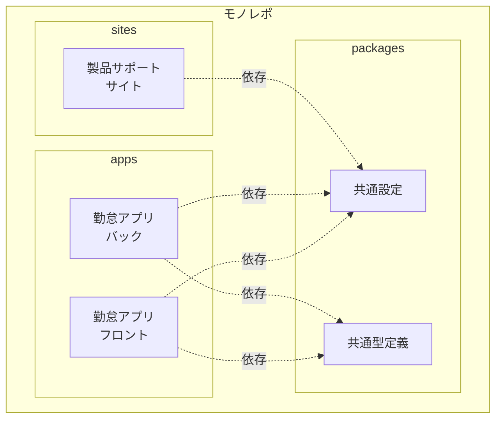

# 仕様書: MVP モノレポ構成

## 概要

勤怠管理システムの最小限の実行可能製品（MVP）のためのモノレポ構成を構築します。

## 目的

- TypeScriptベースのモノレポ環境を構築
- 勤怠アプリケーション（フロント・バック）と製品サポートサイトを統合管理
- 保守性を重視した構成を実現

## 要件

### システム構成



### 勤怠アプリケーション

#### フロントエンド

**技術スタック**:
- React 18+
- TypeScript
- Vite
- プライマリカラー: #007CC0

**デプロイ先**:
- AWS CloudFront + S3

**機能要件**:
- 打刻機能（出勤・退勤）
- ユーザー識別（入力値ベース、認証なし）
- 日時記録の表示

**UI要件**:
- 最低解像度: 1280 x 1024 ピクセル
- 推奨解像度: 1920 x 1080 ピクセル以上
- スマートフォン対応（レスポンシブデザイン、専用アプリなし）

#### バックエンド

**技術スタック**:
- NestJS
- TypeScript
- AWS Lambda（サーバーレス）

**デプロイ先**:
- AWS API Gateway + Lambda

**機能要件**:
- 打刻データの保存
- 打刻履歴の取得
- 簡易的なユーザー識別（認証なし）

**API設計**:
- POST /api/clock-in - 出勤打刻
- POST /api/clock-out - 退勤打刻
- GET /api/records - 打刻履歴取得

### 製品サポートサイト

**技術スタック**:
- Astro
- Starlight（ドキュメンテーションテーマ）
- Markdown

**デプロイ先**:
- AWS CloudFront + S3

**コンテンツ**:
- 製品概要
- 使い方ガイド
- FAQ

### 共通要件

**ビルドツール**:
- Vite

**レンダリング**:
- SSR不要（静的サイト生成またはSPA）

**言語**:
- TypeScript

**パッケージ管理**:
- npm workspaces

**保守性**:
- 共通設定の一元管理
- 共通型定義の共有
- コードの重複を最小化

**テスト**:
- 自動テストは今回のスコープ外（後続タスクで実装）

### 非機能要件

**開発環境**:
- Node.js 18+
- TypeScript 5+

**ディレクトリ構造**:
```
attendance-kit/
├── apps/
│   ├── clock-app-frontend/    # 勤怠アプリ（フロント）
│   └── clock-app-backend/     # 勤怠アプリ（バック）
├── sites/
│   └── product-support/       # 製品サポートサイト
├── packages/
│   ├── config/                # 共通設定
│   └── types/                 # 共通型定義
├── infrastructure/            # AWS CDKコード（既存）
├── package.json               # ルートpackage.json
└── tsconfig.json             # ルートTypeScript設定
```

**ビルド戦略**:
- 各アプリケーションは独立してビルド可能
- ワークスペースを利用した並列ビルド
- 共通パッケージの変更時は依存アプリを自動再ビルド

## 制約

**スコープ外**:
- ユーザー認証機能
- データベーススキーマの詳細設計
- 自動テストの実装
- CI/CDパイプラインの構築（後続で実装）

**技術的制約**:
- AWS無料枠の範囲内での利用を想定
- 初期段階では最小限のインフラ構成

## 成功基準

- [ ] モノレポ構成が正常にセットアップされている
- [ ] 各アプリケーションが個別にビルド可能
- [ ] 共通パッケージが各アプリから参照可能
- [ ] 開発サーバーが正常に起動する
- [ ] ビルド成果物が生成される

## 参考資料

- [Vite Documentation](https://vitejs.dev/)
- [NestJS Documentation](https://nestjs.com/)
- [Astro Documentation](https://docs.astro.build/)
- [Starlight Documentation](https://starlight.astro.build/)
- [npm Workspaces](https://docs.npmjs.com/cli/v8/using-npm/workspaces)
